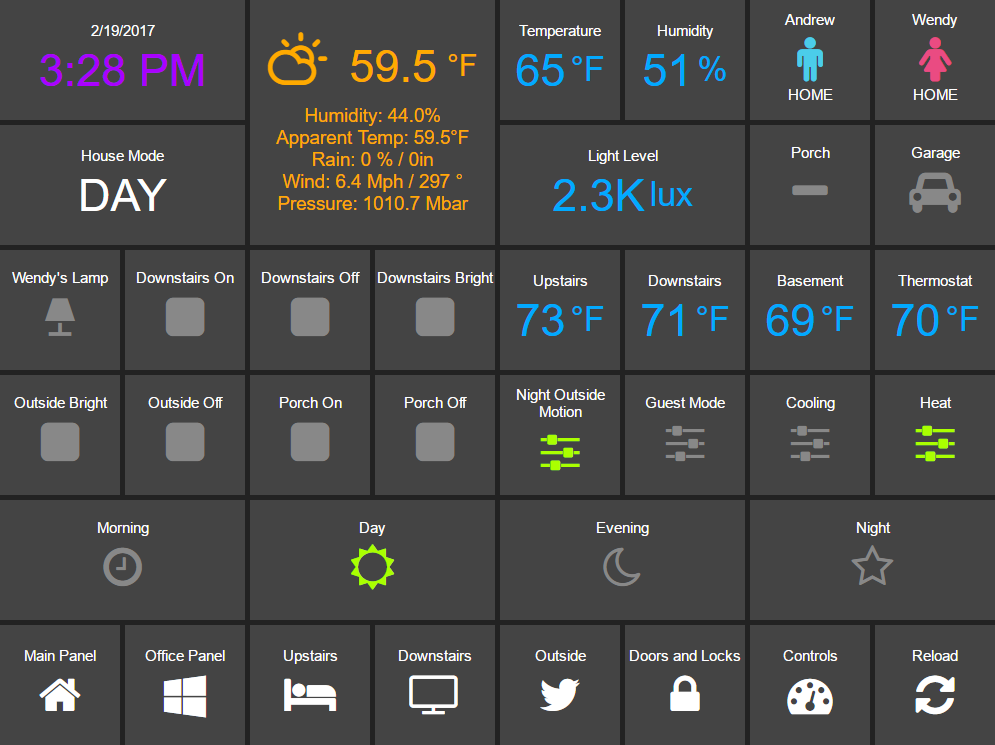

# Description

HADashboard is a dashboard for [Home Assistant](https://home-assistant.io/) that is intended to be wall mounted, and is optimized for distance viewing.



# Installation and Configuration

HADashboard is dependent upon AppDaemon. As a first step please refer to the [AppDaemon Documentation](README.md).

When you have AppDaemon installed and running, configuration of the Dashboard is pretty simple. You just need to add a directive to the config file - `dash_url`.

- `dash_url` - the url you want the dashboard service to listen on

For instance:

```ini
dash_url = http://192.168.1.20:5050
```

Note that at this time only http is supported.

By default, dashboards are searched for under the config directory in a sub directory called `dashboards`. Optionally, you can place your dashboards in a directory other than under the config directory using the `dash_dir` directive.

e.g.:

```ini
dash_dir = /etc/appdaemon/dashboards
```

When you have added those lines, restart AppDaemon and you will be ready to go. If you navigate to the top level, e.g. ```http://192.168.1.20:5050``` in the case above, you will see a welcome page with a list of configured dashboards. If you haven't yet configured any the list will be empty.

When you have created a dashboard you can navigate to it by going to ```http://192.168.1.20:5050/<Dashboard Name>```

If you are using AppDaemon just for the dasboard and not the Apps, you can disable the app engine with the following directive:

```ini
disable_apps = 1
```

This will free up some CPU and memory.

HADashboard pre-compiles all of the user created Dashboard for efficiency. This nehavior is not desirable when developing dashboards as they will only ever be compiled the first time. To prevent this behavior, use the following directive:

```ini
dash_force_compile = 1
```

This will force dashboard recompilation whenever the dashboard is loaded but may run more slowly on lesws powerful hardware. When you are happy with your dashboard remove the directive to benefit from the extra speed if necessary. In a future release this function will be automated.

# Dashboard Configuration

Dashboard configuration is simple yet very powerful. Dashboards can be created in single files or made modular for reuse of blocks of widgets. Dashboards are configured using YAML.

We will start with a simple single file configuration. Create a file with a `.dash` extension in the `dashboards` directory, and pull it up in your favorite editor.

## Main Settings

A top level dashboard will usually have one of a number of initial directives to configure aspects of the dashboard, although they are all optional. An example is as follows:

```yaml
#
# Main arguments, all optional
#
title: Main Panel
widget_dimensions: [120, 120]
widget_margins: [5, 5]
columns: 8
```

These are all fairly self explanatory:

- `title` - the name that will end up in the title of the web page, defaults to "HADashboard".
- `widget_dimensions` - the unit height and width of the individual widgets in pixels. Note tha the absolute size is not too important as on tablets at least the browser will scale the page to fit. What is more important is the aspect ratio of the widgets as this will affect whether or not the dashboard completely fills the tablets screen. The default is [120, 120] (width, height). This works well for a regular iPad. 
- `widget_margins` - the size of blank space between widgets.
- `columns` - the number of columns the dasboard will have.

The very simplest dashboard needs a layout so it can understand where to place the widgets. We use a `layout` directive to tell HADasboard how to place them. Here is an example:

```yaml

layout:
    - light.hall, light.living_room, input_boolean.heating
    - media_player(2x1), sensor.temperature
```

As you can see, here we are refering directly to native Home Assistant entities. From this, HADashboard is able to figure out the right widget type and grab it's friendly name and add it to the dasboard.

The layout command is intended to be visual in how you lay out the widgets. Each enty represents a row on the dashboard, each comma separated widget represents a cell on that row.

Widgets can also have a size associated with them - that is the `(2x1)` directive appended to the name. This is simply the width of the widget in columns and the height of the widget in rows. For instance, `(2x1)` would refer to a widget 2 cells wide and 1 cell high. If you leave of the sizing information, the widget will default to (1x1).

For a better visual cue you can lay the widgets out with appropriate spacing to see what the grid will look like more intuitively:

```yaml
 layout:
    - light.hall,       light.living_room, input_boolean.heating
    - media_player(2x1),                   sensor.temperature
```

... and so on.

Make sure that the number of widths specified adds up to the total number of columns, and don't forget to take into account widgets that are more than one row high (e.g. the weather widget here).

If you want a blank space you can use the special widget name `spacer`.

And that is all there to it, for a simple one file dashboard.


## Detailed Widget Definition

The approach above is ok for simple widgets like lights, but HADashboard has a huge range of customization options. To access these, you need to formally dsefine the widget along with its associated parameters.

To define a widget simply give it a name, a widget type and a number of optional parameters like this:

```yaml
weather:
    widget_type: weather
    units: "&deg;F"
```

Here we have defined a widget of type "weather", and given it an optional parameter to tell it what units to use for temperature. Each widget type will have different required parameters, refer to the documentation below for a complete list for each type. Most if not all widgets support ways to customize colors and text sizes as well as attibutes they need to understand how to link the widget to Home Assistant, such as entity_ids.

Widget definitions are reusable meaning that this particular version of a clock we can place in multiple locations on the same dashboard, or if we construct our dashboards correctly, on multiple different dashboards. Once we have it how we like it, a single change to the widget definition will be reflected across all the widgets using it.

Lets look at a couple more examples of widget definitions:

```yaml
clock:
    widget_type: clock

weather:
    widget_type: weather
    units: "&deg;F"
    
side_temperature:
    widget_type: numeric_sensor
    title: Temperature
    units: "&deg;F"
    precision: 0
    entity: sensor.side_temp_corrected

side_humidity:
    widget_type: numeric_sensor
    title: Humidity
    units: "%"
    precision: 0
    entity: sensor.side_humidity_corrected

andrew_presence:
    widget_type: device_tracker
    title: Andrew
    device: andrews_iphone

wendy_presence:
    widget_type: device_tracker
    title: Wendy
    device: wendys_iphone

mode:
    widget_type: text_sensor
    title: House Mode
    entity: input_select.house_mode

light_level:
    widget_type: numeric_sensor
    title: Light Level
    units: "lux"
    precision: 0
    shorten: 1
    entity: sensor.side_multisensor_luminance_25_3
        
porch_motion:
    widget_type: binary_sensor
    title: Porch
    entity: binary_sensor.porch_multisensor_sensor_27_0

garage:
    widget_type: switch
    title: Garage
    entity: switch.garage_door
    icon_on: fa-car
    icon_off: fa-car
    warn: 1

```

Now, instead of an entity id we refer to the name of the widgets we just defined:

```yaml

layout:
    - clock(2x1), weather(2x2), side_temperature(1x1), side_humidity(1x1), andrew_presence(1x1), wendy_presence(1x1)
    - mode(2x1), light_level(2x1), porch_motion(1x1), garage(1x1)
```

It is also possible to add a widget from a standalone file. The file will contain a single widget definition. To create a clock widget this way we would make a file called `clock.yaml` and place it in the dashboard directory along with the dashboard. The contents would look something like this:

```yaml
widget_type: clock
background_color: red
```

Note that the indentation level starts at 0. To include this file, just reference a widget called `clock` in the layout, and HADashboard will automatically load the widget.

And that is all there to it, for a simple one file dashboard.

# Advanced Dashboard Definition

When you get to the point where you have multiple dashboards, you may want to take a more modular approach, as you will find that in many cases you want to reuse parts of other dashboards. For instance, I have a common header for mine consisting of a row or two of widgets I want to see on everey dashboard. I also have a footer of controls to switch between dashboards that I want on each dashboard as well.

To facilitate this, it is possible to include additional files, inline to build up dashboards in a more modular fashion. These additional files end in `.yaml` to distinguish them from top level dashboards. They can contain additional widget definitions and also optionally their own layouts.

The sub files are included in the layout using a variation of the layout directive:

```yaml
layout:
    - include: top_panel
```

This will look for a file called `top_panel.yaml` in the dashboards directory, then include it. There are a couple of different ways this can be used.

- If the yaml file includes it's own layouts directive, the widgets from that file will be placed as a block, in the way described by its layout, making it reusable. You can change the order of the blocks inclusion by moving where in the original layout directive you include them.
- If the yaml file jsut includes widget definitions, it is possible to perform the layout in the higher level dash if you prefer so you still get an overall view of the dashboard. This approach has the benefit that you can be completely flexible in the layout wheras the first method defines fixed layouts for the included blocks.

I prefer the completely modular approach - here is an example of a full top level dashboard created in that way:

```yaml
title: Main Panel
widget_dimensions: [120, 120]
widget_margins: [5, 5]
columns: 8

layout:
    - include: top_panel
    - include: main_middle_panel
    - include: mode_panel
    - include: bottom_panel
```

As you can see, it includes for modular pieces. Since these pieces all have their own layout information there is no need for additional layout in the top level file. Here is an example of one of the self contained sub modules (mode_panel.yaml):

```yaml
clock:
    widget_type: clock
    #background_color: "#00f"
    #text_color: green
    #text_size: 200%
    #title_color: red
    #title_size: 200%

weather:
    widget_type: weather
    units: "&deg;F"
    #background_color: "#00f"
    #text_color: green
    #text_size: 50%
    #title_color: red
    #title_size: 200%
    #unit_color: pink
    #unit_size: 100%
    
side_temperature:
    widget_type: numeric_sensor
    title: Temperature
    units: "&deg;F"
    precision: 0
    entity: sensor.side_temp_corrected
    #background_color: "#00f"
    #text_color: green
    #text_size: 250%
    #unit_color: red
    #unit_size: 100%
    #title_color: red
    #title_size: 100%

side_humidity:
    widget_type: numeric_sensor
    title: Humidity
    units: "%"
    precision: 0
    entity: sensor.side_humidity_corrected

andrew_presence:
    widget_type: device_tracker
    title: Andrew
    device: andrews_iphone
    icon_on: fa-male
    #background_color: "#00f"
    icon_color_active: "#4bcdea"
    #icon_color_inactive: red
    #icon_size: 500%
    #title_color: red
    #title_size: 200%
    #state_color: red
    #state_size: 200%

wendy_presence:
    widget_type: device_tracker
    title: Wendy
    icon_color_active: "#ea4b82"
    icon_on: fa-female
    device: dedb5e711a24415baaae5cf8e880d852

mode:
    widget_type: text_sensor
    title: House Mode
    entity: input_select.house_mode
    #background_color: "#00f"
    #text_color: green
    #text_size: 200%
    #title_color: red
    #title_size: 200%

light_level:
    widget_type: numeric_sensor
    title: Light Level
    units: "lux"
    precision: 0
    shorten: 1
    entity: sensor.side_multisensor_luminance_25_3
        
porch_motion:
    widget_type: binary_sensor
    title: Porch
    entity: binary_sensor.porch_multisensor_sensor_27_0

garage:
    widget_type: switch
    title: Garage
    entity: switch.garage_door
    icon_on: fa-car
    icon_off: fa-car
    warn: 1

layout:
    - clock(2x1), weather(2x2), side_temperature, side_humidity, andrew_presence, wendy_presence
    - mode(2x1), light_level(2x1), porch_motion, garage

```

Now if we take a look at that exact same layout, but assume that just the widget definitions are in the sub-blocks, we would end up with something like this - note that we must explicitly lay out each widget we have included in the other files:

```yaml
title: Main Panel
widget_dimensions: [120, 120]
widget_margins: [5, 5]
columns: 8

layout:
    - include: top_panel
    - include: main_middle_panel
    - include: mode_panel
    - include: bottom_panel
    - clock(2x1), weather(2x2), side_temperature, side_humidity, andrew_presence, wendy_presence
    - mode(2x1), light_level(2x1), porch_motion, garage
    - wlamp_scene, don_scene, doff_scene, dbright_scene, upstairs_thermometer, downstairs_thermometer, basement_thermometer, thermostat_setpoint  
    - obright_scene, ooff_scene, pon_scene, poff_scene, night_motion, guest_mode, cooling, heat
    - morning(2x1), day(2x1), evening(2x1), night(2x1)
    - load_main_panel, load_upstairs_panel, load_upstairs, load_downstairs, load_outside, load_doors, load_controls, reload  
```

In this case, the actual layout including a widget must be after the include as you might expect.

A few caveats for loaded sub files:

- Sub files can include other subfiles to a maximum depth of 10 - please avoid circular references!
- When layout information is included in a sub file, the subfile must comprise 1 or more complete rows

# Widget Reference

Here is the current list of widgets and their description and supported parameters:

## clock

A simple 12 hour clock with the date. Not currently very customizable but it will be improved upon.

### Mandatory arguments: 

None

### Optional Arguments: 

None

### Cosmetic Arguments: 

- `background_color`
- `text_color`
- `text_size`
- `title_color`
- `title_size`

## weather

Up to date weather reports. Requires dark sky to be configured in Home Assistant with at minimum the following sensors:

### Mandatory arguments: 

None

### Optional Arguments: 

None

### Cosmetic Arguments: 

- `background_color`
- `text_color`
- `text_size`
- `title_color`
- `title_size`
    
## numeric_sensor

A widget to report on values for any numeric sensor in Home Assistant

### Mandatory Arguments:

- `entity` - the entity_id of the sensor to be monitored

### Optional Arguments:

- `title` - the title displayed on the tile
- `units` - the unit symbol to be displayed
- `precision` - the number of decimal places
- `shorten` - if set to one, the widget will abbreviate the readout for high numbers, e.g. `1.1K` instead of `1100`

### Cosmetic Arguments: 

- `background_color`
- `text_color`
- `text_size`
- `unit_color`
- `unit_size`
- `title_color`
- `title_size`

## device_tracker

A Widget that reports on device tracker status. It can also be used to toggle the status between "home" and "not_home".

### Mandatory Arguments:

- `device` - name of the device from `known_devices.yaml`, *not* the entity_id.

### Optional Arguments:

- `title` - the title displayed on the tile

### Cosmetic Arguments

- `background_color`
- `icon_color_active`
- `icon_color_inactive`
- `icon_on`
- `icon_off`
- `icon_size`
- `title_color`
- `title_size`
- `state_color`
- `state_size`
- `warn`
    
## text_sensor

A widget to show the value of any text based sensor

### Mandatory Arguments

- `entity` - the entity_id of the sensor to be monitored

### Optional Arguments:

- `title` - the title displayed on the tile

### Cosmetic Arguments

- `background_color`
- `text_color`
- `text_size`
- `title_color`
- `title_size`

## label

A widget to show a simple static text string

### Mandatory Arguments

None

### Optional Arguments:

- `title` - the title displayed on the tile
- `text` - the text displayed on the tile

### Cosmetic Arguments

- `background_color`
- `text_color`
- `text_size`
- `title_color`
- `title_size`

## scene

A widget to activate a scene

### Mandatory Arguments

- `entity` - the entity_id of the scene

### Optional Arguments:

- `title` - the title displayed on the tile

### Cosmetic Arguments
    
- `background_color`
- `icon_color_active`
- `icon_color_inactive`
- `icon_on`
- `icon_off`
- `icon_size`
- `title_color`
- `title_size`
- `state_color`
- `state_size`
- `warn`

## switch

A widget to monitor and activate a switch

### Mandatory Arguments

- `entity` - the entity_id of the switch

### Optional Arguments:

- `title` - the title displayed on the tile

### Cosmetic Arguments
    
- `background_color`
- `icon_color_active`
- `icon_color_inactive`
- `icon_on`
- `icon_off`
- `icon_size`
- `title_color`
- `title_size`
- `state_color`
- `state_size`
- `warn`

## input_boolean

A widget to monitor and activate an input_boolean

### Mandatory Arguments

- `entity` - the entity_id of the input_boolean

### Optional Arguments:

- `title` - the title displayed on the tile

### Cosmetic Arguments
    
- `background_color`
- `icon_color_active`
- `icon_color_inactive`
- `icon_on`
- `icon_off`
- `icon_size`
- `title_color`
- `title_size`
- `state_color`
- `state_size`
- `warn`


## binary_sensor

A widget to monitor a binary_sensor

### Mandatory Arguments

- `entity` - the entity_id of the binary_sensor

### Optional Arguments:

- `title` - the title displayed on the tile

### Cosmetic Arguments
    
- `background_color`
- `icon_color_active`
- `icon_color_inactive`
- `icon_on`
- `icon_off`
- `icon_size`
- `title_color`
- `title_size`
- `state_color`
- `state_size`
- `warn`

## light

A widget to monitor and contol a dimmable light

### Mandatory Arguments

- `entity` - the entity_id of the light

### Optional Arguments:

- `title` - the title displayed on the tile
- `on_brightness` - how bright you want the light to come on when activated in percent.
- `increment` - the size of step in brightness when fading the light up or down

### Cosmetic Arguments
   
- `backgropund_color`
- `icon_on`
- `icon_off`
- `icon_size`
- `title_color`
- `title_size`

## input_slider

A widget to monitor and contol an input slider

### Mandatory Arguments

- `entity` - the entity_id of the input_slider

### Optional Arguments:

- `title` - the title displayed on the tile
- `increment` - the size of step in brightness when fading the slider up or down
- `units` - the unit symbol to be displayed

### Cosmetic Arguments
   
- `background_color`
- `icon_on`
- `icon_off`
- `icon_size`
- `title_color`
- `title_size`

## media_player

A widget to monitor and contol a media player light

### Mandatory Arguments

- `entity` - the entity_id of the media player

### Optional Arguments:

- `title` - the title displayed on the tile

### Cosmetic Arguments
   
- `backgropund_color`
- `icon_on`
- `icon_off`
- `icon_size`
- `title_color`
- `title_size`

## navigate

A widget to navgigate to a new URL, intended to be used for switching between dashboards

### Mandatory Arguments

- `url` - the url to navigate to. To Specify a new dashboard use a relative path, e.g. `/MainDash`

### Optional Arguments:

- `title` - the title displayed on the tile

### Cosmetic Arguments
   
- `icon`
  
## reload

A widget to reload the current dashboard.

### Mandatory Arguments

None.

### Optional Arguments:

- `title` - the title displayed on the tile

### Cosmetic Arguments
   
- `icon`

# Widget Development

Widget Development is currently not supported in the Beta version of HADashboard. When the full release is available, there will be a fully developed Widget API and a description of how to add new widgets and contribute them back to the community.

# Skin development

Skin Development is currently not supported in the Beta version of HADashboard. When the full release is available it will be easy to design and contibute new skins based on CSS styles.
