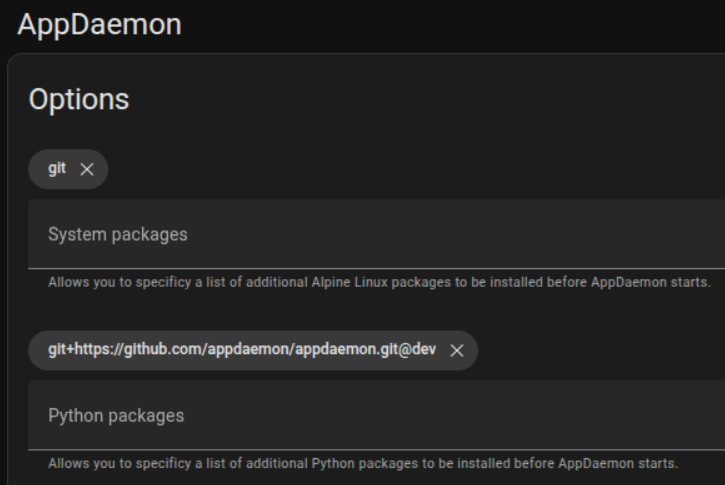

# AppDaemon Add-on

The [AppDaemon python package] and the [AppDaemon Add-on for Home Assistant] (maintained by [Frenck]) have no official relationship. They have different versions and release schedules, but are both commonly run using Docker containers. The AppDaemon project provides a [Docker container], and the add-on uses another one that includes some things to help it integrate with Home Assistant's Supervisor.

[AppDaemon python package]: https://pypi.org/project/appdaemon/
[AppDaemon Add-on for Home Assistant]: https://github.com/hassio-addons/addon-appdaemon
[Frenck]: https://github.com/frenck
[Docker container]: https://hub.docker.com/r/acockburn/appdaemon

:::{tip}
[Install AppDaemon Add-on](https://my.home-assistant.io/redirect/supervisor_addon/?addon=a0d7b954_appdaemon&repository_url=https%3A%2F%2Fgithub.com%2Fhassio-addons%2Frepository)
:::

:::{note}
- **Add-on Repository**: [hassio-addons/addon-appdaemon](https://github.com/hassio-addons/addon-appdaemon)
- **AppDaemon Repository**: [AppDaemon/appdaemon](https://github.com/AppDaemon/appdaemon)
:::

## Workflow

An easy way to work with the AppDaemon config files is to expose them with a [Samba] share, which uses [smb] to make folders accessible across a network. This is an old, well-established standard that works really well across platforms. The Samba add-on makes the AppDaemon config folder accessible at `addon_configs/a0d7b954_appdaemon`. That share can be mounted on your local system as a network drive where it can be accessed with an IDE like [VSCode] or [PyCharm].

See [this section](https://www.home-assistant.io/common-tasks/os/#installing-and-using-the-samba-add-on) of the Home Assistant docs for more information about accessing samba shares.

[Samba]: https://www.samba.org/
[smb]: https://en.wikipedia.org/wiki/Server_Message_Block
[VSCode]: https://code.visualstudio.com/
[PyCharm]: https://www.jetbrains.com/pycharm/

:::{tip}
[Install Samba Add-on](https://my.home-assistant.io/redirect/supervisor_addon/?addon=core_samba) [(configuration docs)](https://github.com/home-assistant/addons/blob/master/samba/DOCS.md)
:::


## Paths

| Name                  | Inside Container | Samba                             | Host                                                  |
| --------------------- | ---------------- | --------------------------------- | ----------------------------------------------------- |
| Home Assistant config | /homeassistant   | /config                           | /mnt/data/supervisor/homeassistant                    |
| AppDaemon config      | /config          | /addon_configs/a0d7b954_appdaemon | /mnt/data/supervisor/addon_configs/a0d7b954_appdaemon |
| Home Assistant Media  | /media           | /media                            | /mnt/data/supervisor/media                            |
| Home Assistant Share  | /share           | /share                            | /mnt/data/supervisor/share                            |

## Config

### Token

The authentication token for the Hass plugin is automatically provided by the Hass Supervisor using the `SUPERVISOR_TOKEN` environment variable.

### System Packages

System packages are installed into the container environment using [apk] before AppDaemon is launched. Anything from the [Alpine Package Index] can be used.

For example, to install [pandas]:
```
py3-pandas
```

[pandas]: https://pandas.pydata.org/
[apk]: https://wiki.alpinelinux.org/wiki/Alpine_Package_Keeper
[Alpine Package Index]: https://pkgs.alpinelinux.org/packages?branch=v3.22

:::{tip}
Many python packages can be installed this way, which is much faster and more reliable than using pip. The packages usually have a <a href="https://pkgs.alpinelinux.org/packages?name=py3*&branch=v3.22"><code>py3-*</code>prefix</a>.
:::

### Python Packages

Python packages are installed into the container environment using pip before AppDaemon is launched. Any package on PyPI can be used. Pip also [supports targeting VCS systems](https://pip.pypa.io/en/stable/topics/vcs-support/#supported-vcs), so any python packages on GitHub can be installed directly in several ways:

- `git+<github_url>@<branch>`
- `git+<github_url>@<short commit hash>`
- `<github_url>/archive/refs/heads/<long commit hash>.zip`



:::{tip}
The add-on will use the version of AppDaemon installed from GitHub in the example screenshot above. This makes it easy to control which version of AppDaemon the add-on uses.

- `git+https://github.com/AppDaemon/appdaemon@dev`
- `git+https://github.com/AppDaemon/appdaemon@4.4.2`
- `git+https://github.com/AppDaemon/appdaemon@beaa161`

:::


## Docker Mechanics

This section shows some of how the AppDaemon add-on container works in the supervised environment of [Hass OS] and is just for informational purposes. It uses the [Advanced SSH & Web Terminal Add-on] to inspect the Docker container.

[Hass OS]: https://github.com/home-assistant/operating-system
[Advanced SSH & Web Terminal Add-on]: https://github.com/hassio-addons/addon-ssh/tree/main

:::{tip}
[Install Advanced SSH & Web Terminal Add-on](https://my.home-assistant.io/redirect/supervisor_addon/?addon=a0d7b954_ssh&repository_url=https%3A%2F%2Fgithub.com%2Fhassio-addons%2Frepository)
:::

:::{warning}
Protection mode has to be disabled for the SSH add-on for the following instructions to work. It's recommended to only disable it temporarily. Proceed carefully and at your own risk.
:::

**Check the status of the AppDaemon container**

```zsh
docker ps --format "table {{.ID}}\t{{.Names}}\t{{.Status}}" | grep appdaemon
```

**Check the AppDaemon container logs**
```zsh
docker logs --tail 10 addon_a0d7b954_appdaemon
```

**Enter the AppDaemon container**
```zsh
docker exec -it addon_a0d7b954_appdaemon /bin/bash
```

**Show volume mounts from the AppDaemon container**
```zsh
docker inspect --format='{{json .Mounts}}' addon_a0d7b954_appdaemon | \
    jq -r '.[] | select(.Type == "bind") | [.Destination, .Source] | @tsv'
```

**View installed Python packages**
```zsh
docker exec addon_a0d7b954_appdaemon pip list
```
