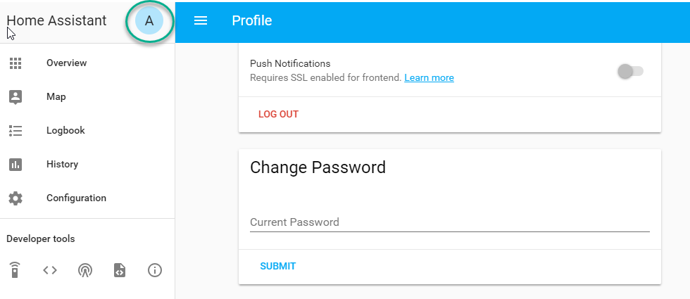

Configuration
-------------

When you have AppDaemon (AD) installed by either method you are ready to
start working on the ``appdaemon.yaml`` file. For docker users, you will
already have a skeleton to work with. For pip users, you need to create
a configuration directory somewhere (e.g., ``/home/homeassistant/conf``)
and create a file in there called ``appdaemon.yaml``.

Initial Setup
~~~~~~~~~~~~~

Your initial ``appdaemon.yaml`` file should look something like this if you are using the HASS plugin:

.. code:: yaml

     appdaemon:
       time_zone: CET
       latitude: 51.725
       longitude: 14.3434
       elevation: 0
       plugins:
         HASS:
           type: hass
           ha_url: <some_url>
           token: <some_long_lived_access_token>

The top level consists of a number of sections:

Log Configuration
~~~~~~~~~~~~~~~~~

The ``logs:`` section is optional. It consists of a number of log entries that describe the various system and user-defined logs. The logs named ``main_log``, ``error_log``, ``diag_log`` and ``access_log`` have special significance and are used to describe AppDaemons 4 main logs. Any other named log sections will result in the creation of a user-defined log, which can be written to by your apps. The 4 built-in logfiles are used as follows:

-  ``main_log`` is the path to where you want ``AppDaemon`` to
   keep its main log.
-  ``error_log`` is the name of the logfile for errors - this
   will usually be errors during compilation and execution of the apps.
   If ``errorfile = STDERR`` errors are sent to stderr instead of a
   file, if not specified, the output will be sent to STDERR.
-  ``diag_log`` is the name of the log file for diagnostic information. This will contain information form the ``log_thread_actions`` parameter, as well as information dumped from AppDaemon's internal state when the AppDaemon process is sent a ``SIGUSR1`` signal.
- ``access_log`` is the log that AppDaemon will write access information to for HADashboard and the admin interface.

All 4 logs have defaults, so they do not need to be specified, but if any parameters are defined, they will override the defaults.

A simple logs section might look like this:

.. code:: yaml

    logs:
      main_log:
        filename: /export/pegasus/hass/appdaemon_test/logs/appdaemon.log
      access_log:
        filename: /export/pegasus/hass/appdaemon_test/logs/access.log
      error_log:
        filename: /export/pegasus/hass/appdaemon_test/logs/error.log
      diag_log:
        filename: /export/pegasus/hass/appdaemon_test/logs/diag.log
        log_generations: 5
        log_size: 1024
        format: "{asctime} {levelname:<8} {appname:<10}: {message}"
      test_log:
        name: TestLog
        filename: /export/pegasus/hass/appdaemon_test/logs/test.log

All directives are optional with the exception of ``name`` for user defined logs. The directives have the following meanings:

The directives are as follows:

-  ``filename`` (optional) is the path to where you want the file to be written. If the directive is not
   specified, the output is sent to STDOUT.
-  ``log_size`` (optional) is the maximum size a logfile will get to
   before it is rotated if not specified, this will default to 1000000
   bytes.
-  ``log_generations`` (optional) is the number of rotated logfiles that
   will be retained before they are overwritten if not specified, this
   will default to 3 files.
- ``format`` (optional) Format string for the log file - standard `str.format() logger format <https://docs.python.org/3.6/library/string.html#format-string-syntax>`__
- ``date_format`` (optional) - Format string to specify how the date is rendered in standard `datetime strftime() format <https://docs.python.org/3.6/library/datetime.html#strftime-strptime-behavior>`__
- ``filter_threshold`` (optional) - number of repetitions of a log line allowed before filtering starts (default is 1). Setting ``filter_threshold`` to zero will turn off log filtering entirely - since AppDaemon relies on this mechanism internally to prevent certain types of log loops, this is not recommended.
- ``filter_timeout`` (optional) - timeout for log filtering. Duplicate log entries that are output less frequently than this value will not have filtering applied (default is 0.9 seconds)
- ``filter_repeat_delay`` (optional) - when filtering, repeating messages will be printed out periodically every ``filter_repeat_delay`` seconds (default is 5 seconds)

Note: Filter parameters are set globally, but are applied to individual apps and modules within AppDaemon. This means that log messages interspersed from different apps or from AppDaemon itself even though different, will not reset the filtering of log messages from an individual app if they carry on repeating.

In the above example, a user-defined log called ``test_log`` has also been created this can be accessed from apps directly from its logger object, or from the self.log call as follows:

.. code:: python

    # Native logger
    testlogger = self.get_user_log("test_log")
    testlogger.info("Hello %s", "jim")
    # self.log()
    self.log("Hello", log="test_log")


Note that the AppDaemon logs use an enhanced formatter that allows interpolation of the App Name in the logger output as well as all the other standard fields. In addition, the ``{asctime}`` token will give the right results if time travel is in use. For example, the default logfile format for AppDaemon's main log is:

.. code::

    {asctime} {levelname} {appname:<20}: {message}

AppDaemon's default time format is ``%Y-%m-%d %H:%M:%S.%f%z``.

AppDaemon Configuration
~~~~~~~~~~~~~~~~~~~~~~~

The ``appdaemon:`` section has a number of directives:

-  ``filters`` (optional) - see below.
-  ``plugins`` (required) - see below.
-  ``latitude`` (required) - latitude for AppDaemon to use (decimal format).
-  ``longitude`` (required) - longitude for AppDaemon to use (decimal format).
-  ``elevation`` (required) - elevation for AppDaemon to use in meters above sea level.
-  ``time_zone`` (required) - timezone for AppDaemon to use (e.g. America/New_York).
-  ``app_dir`` (Optional) - This can be used to place one's apps in a directory, other than under the config directory.
-  ``exclude_dirs`` (optional) - a list of subdirectories to ignore under the apps directory when looking for apps. It should be noted AD will by default ignore all directories with a "." in its path (hidden folder).
- ``missing_app_warnings`` (optional) - by default, AppDaemon will log a warning if it finds a python file that has no associated configuration in an apps.yaml file. If this parameter is set to ``0`` the warning will be suppressed. This allows non-appdaemon python files to be distributed along with apps.
- ``invalid_config_warnings`` (optional) - by default, AppDaemon will log a warning if it finds an apps.yaml or apps.toml file that doesn't include "class" and "module" for an app. If this parameter is set to ``0`` the warning will be suppressed. This is intended to ease the distribution of additional files along with apps.
- ``production_mode`` (optional) - If set to true, AppDaemon will only check for changes in Apps and apps.yaml files when AppDaemon is restarted, as opposed to every second. This can save some processing power on busy systems. Defaults to ``False``. This can also be changed from within apps, using the ``set_production_mode`` API call.
- ``thread_duration_warning_threshold`` (optional) - AppDaemon monitors the time that each tread spends in an App. If a thread is taking too long to finish a callback, it may impact other apps. AppDaemon will log a warning if any thread is over the duration specified in seconds. The default is 10 seconds, setting this value to ``00`` will disable the check.
- ``log_thread_actions`` (optional) - if set to 1, AppDaemon will log all callbacks on entry and exit for the scheduler, events, and state changes - this can be useful for troubleshooting thread starvation issues

When using the ``exclude_dirs`` directive, you should supply a list of directory names that should be ignored. For example:

.. code:: yaml

    exclude_dirs:
        - dir1
        - dir2
        - dir3

AppDaemon will search for matching directory names at any level of the folder hierarchy under appdir and will exclude that directory and any beneath it. It is not possible to match multiple level directory names e.g., ``somedir/dir1``. In that case, the match should be on ``dir1``, with the caveat that if you have dir1 anywhere else in the hierarchy, it will also be excluded.

Advanced Appdaemon Configuration
~~~~~~~~~~~~~~~~~~~~~~~~~~~~~~~~

The following items provide a high level of control over AppDaemon's internal functions but for most users should be left at the default settings.

-  ``total_threads`` (optional) - the number of dedicated worker threads to create for
   running the apps. Normally, AppDaemon will create enough threads to provide one per app, or default to 10 if app pinning is turned off. Setting this to a value will turn off automatic thread management.
-  ``pin_apps`` (optional) - When true (the default) Apps will be pinned to a particular thread which avoids complications around re-entrant code and locking of instance variables
-  ``pin_threads`` (optional) - Number of threads to use for pinned apps, allowing the user to section off a sub-pool just for pinned apps. Default is to use all threads for pinned apps.
- ``threadpool_workers`` (optional) - the number of max_workers threads to be used by AD internally to execute calls asynchronously. This defaults to ``10``.
- ``load_distribution`` - Algorithm to use for load balancing between unpinned apps. Can be ``round-robin`` (the default), ``random`` or ``load``
-  ``timewarp`` (optional) - equivalent to the command line flag ``-t`` but will take precedence
-  ``qsize_warning_threshold`` - total number of items on thread queues before a warning is issued, defaults to 50
-  ``qsize_warning_step`` - when total qsize is over ````qsize_warning_threshold`` a warning will be issued every time the ``qsize_warning_step`` times the utility loop executes (normally once every second), default is 60 meaning the warning will be issued once every 60 seconds.
-  ``qsize_warning_iterations`` - if set to a value greater than 0, when total qsize is over ````qsize_warning_threshold`` a warning will be issued every time the ``qsize_warning_step`` times the utility loop executes but not until the qsize has been excessive for a minimum of ``qsize_warning_iterations``. This allows you to tune out brief expected spikes in Q size. Default is 5, usually meaning 5 seconds.
-  ``uvloop`` (optional) - When ``True``, AD will switch from using default python asyncio loop, to utilizing the uvloop. This is said to improve the speed of the loop. More can be read `here <https://magic.io/blog/uvloop-blazing-fast-python-networking>`__ about uvloop.
- namespaces (optional) - configure one or more User Defined Namespaces and set their writeback strategy

.. code:: yaml

    namespaces:
        andrew:
          # writeback is safe, performance or hybrid
          writeback: safe
        jim:
          writeback: performance
        fred:
          writeback: hybrid

Secrets
~~~~~~~

AppDaemon supports the use of `secrets` in the configuration file, to allow separate storage of sensitive information such as passwords. For this to work, AppDaemon expects to find a file called ``secrets.yaml`` in the configuration directory, or a named file introduced by the top level ``secrets:`` section. The file should be a simple list of all the secrets. The secrets can be referred to using a !secret value in the configuration file.

The ``secret:`` section is optional. If it doesn't exist, AppDaemon looks for a file called ``secrets.yaml`` in the config directory.

An example ``secrets.yaml`` might look like this:

.. code:: yaml

    token: ABCDEFG
    appdaemon_key: password456

The secrets can then be referred to as follows:

.. code:: yaml

    appdaemon:
      api_key: !secret appdaemon_key
      threads: '10'
      plugins:
        HASS:
          type: hass
          token: !secret token
          ha_url: http://192.168.1.20:8123

Filters
~~~~~~~

The use of filters allows you to run an arbitrary command against a file with a specific extension to generate a new .py file. The use-cases for this are varied, but this can be used to run a preprocessor on an app, or perhaps some kind of global substitute or any of a number of other commands. AppDaemon, when made aware of the filter via configuration, will look for files in the appdir with the specified extension, and run the specified command on them, writing the output to a new file with the specified extension. The output extension would usually be a .py file which would then be picked up by normal app processing, meaning that if you edit the original input file, the result will be a new .py file that is part of an app which will then be restarted.

In addition, it is possible to chain multiple filters, as the filter list is processed in order - just ensure you end with a .py file.

A simple filter would look like this:

    .. code:: yaml

        filters:
          - command_line: /bin/cat $1 > $2
            input_ext: cat
            output_ext: py

This would result in AppDaemon looking for any files with the extension ``.cat`` and running the ``/bin/cat`` command and creating a file with an extension of ``.py``. In the ``command_line``, ``$1`` and ``$2`` are replaced by the correctly named input and output files. In this example, the output is just a copy of the input, but this technique could be used with commands such as sed and awk, or even m4 for more complex manipulations.

A chained set of filters might look like this:

    .. code:: yaml

        filters:
          - command_line: /bin/cat $1 > $2
            input_ext: mat
            output_ext: cat
          - command_line: /bin/cat $1 > $2
            input_ext: cat
            output_ext: py

These will run in order resulting in edits to a ``.mat`` file running through the 2 filters and resulting in a new .py file which will run as the app in the usual way.

Finally, it is possible to have multiple unconnected filters like so:

    .. code:: yaml

        filters:
          - command_line: /bin/cat $1 > $2
            input_ext: mat
            output_ext: .py
          - command_line: /bin/cat $1 > $2
            input_ext: cat
            output_ext: py

Here we have defined ``.mat`` and ``.cat`` files as both creating new apps. In a real-world example the ``command_line`` would be different.

Plugins
~~~~~~~

In the example above, you will see that home assistant is configured as a plugin (called HASS).
For most applications there is little significance to this - just configure a single plugin for HASS exactly as above. However, for power users, this is a way to allow AppDaemon to work with more than one installation of Home Assistant and/or other plugins such as MQTT.

The plugin architecture also allows the creation of plugins for other purposes, e.g.,
different home automation systems.

To configure more than one plugin, simply add a new section to the plugins list and configure it appropriately.
Before you do this, make sure to review the section on namespaces to fully understand what this entails, and if you are using more than one plugin, make sure you use the namespace directive to create a unique namespace for each plugin.
(One of the plugins may be safely allowed to use the default value, however, any more than that will require the namespace directive. There is also no harm in giving them all namespaces, since the default namespace is literally ``default``
and has no particular significance, it's just a different name, but if you use namespaces other than default you will need to change your Apps to understand which namespaces are in use.).

Plugin Configuration
====================

In the required ``plugins:`` sub-section, there will usually be one or more plugins with a number of directives introduced by a top level name. Some of these are common to all plugins:

-  ``type`` (required) The type of the plugin.
-  ``namespace`` (optional) - which namespace to use. This can safely be left out unless you are planning to use multiple plugins (see below)
- ``disable`` (optional) - if set to ``true``, the plugin will not be loaded - defaults to ``false``.

Plugins also support some optional parameters:

- ``refresh_delay`` - How often the complete state of the plugin is refreshed, in seconds. Default is 600 seconds.
- ``refresh_timeout`` - How long to wait for the state refresh before cancelling it, in seconds. Default is 30 seconds.
- ``persist_entities`` - If `True` all entities created within the plugin's namespace will be persitent within AD. So in the event of a restart, the entities will be recreated in the same namespace

The rest will vary depending upon which plugin type is in use.

Configuration of the HASS Plugin
================================

To configure the HASS plugin, in addition to the required parameters above, you will need to add the following:

-  ``type:`` This must be declared and it must be ``hass``
-  ``ha_url`` (required for the ``hass`` plugin) is a reference to your home assistant installation and
   must include the correct port number and scheme (``http://`` or ``https://`` as appropriate)
-  ``ha_key`` should be set to your home assistant API password if you have one, otherwise it can be removed. This directive is deprecated - you should use the ``token`` directive instead
-  ``token`` (required) - set the long-lived token for access to your hass instance (see later for a description of how to create a long-lived access token)
-  ``cert_verify`` (optional) - flag for cert verification for HASS -
   set to ``False`` to disable verification on self-signed certs, or certs for which the address used doesn't match the cert address (e.g., using an internal IP address)
-  ``api_port`` (optional) - Port the AppDaemon RESTFul API will listen
   on. If not specified, the RESTFul API will be turned off.
-  ``app_init_delay`` (optional) - If specified, when AppDaemon connects to HASS each time, it will wait for this number of seconds before initializing apps and listening for events. This is useful for HASS instances that have subsystems that take time to initialize (e.g., zwave).
-  ``retry_secs`` (optional) - If specified, AD will wait for this many seconds in between retries to connect to HASS (default 5 seconds)
- appdaemon_startup_conditions - see `HASS Plugin Startup Conditions <#hass-plugin-startup-conditions>`__
- plugin_startup_conditions - see `HASS Plugin Startup Conditions <#hass-plugin-startup-conditions>`__

For example:

.. code:: yaml

    app_dir: /etc/appdaemon/apps

An example of the HASS plugin could look like the following:

.. code:: yaml

    secrets: /some/path
    log:
      accessfile: /export/hass/appdaemon_test/logs/access.log
      errorfile: /export/hass/appdaemon_test/logs/error.log
      logfile: /export/hass/appdaemon_test/logs/appdaemon.log
      log_generations: 3
      log_size: 1000000
    appdaemon:
      threads: 10
      time_zone: <time zone>
      api_port: 5000
      api_key: !secret api_key
      api_ssl_certificate: <path/to/root/CA/cert>
      api_ssl_key: <path/to/root/CA/key>
      plugins:
        HASS:
          type: hass
          ha_url: <some_url>
          token: <token>
          cert_path: <path/to/root/CA/cert>
          cert_verify: True
          namespace: default


HASS Authentication
+++++++++++++++++++

HASS has recently moved to a new authentication model. For programs such as ``AppDaemon`` it is necessary to create a Long-Lived Access Token, then provide that token to AppDaemon with the ``token`` directive in the HASS plugin parameters. To create a Long-Lived Access Token for AppDaemon, do the following:

1. Login as the user that you want to create the token for and open the user profile. The profile is found by clicking the icon next to the ``Home Assistant`` label to the left of the web ui when the burger menu is clicked:



2. At the bottom of the user profile is the Long-Lived Access Tokens section. Click on "Create Token"

.. figure:: images/create_token.png
   :alt: Create Token

This will pop up a dialog that asks you for the name of the token - this can be anything, it's just to remind you what the token was created for - ``AppDaemon`` is as good a name as any. When you are done click ``OK``

.. figure:: images/popup.png
   :alt: Popup


3. A new dialog will popup with the token itself showing:

.. figure:: images/token.png
   :alt: Token

Copy this string and add it as the argument of the ``token`` directive in your HASS Plugin section:

.. code:: yaml

    token: ABCDEF

A real token will be a lot longer than this and will consist of a string of random letters and numbers. For example:

``eyJ0eXAiOiJKV1QiLCJhbGciOiJIUzI1NiJ9.eyJpc3MiOiIwZmRkYmE0YTM0MTY0...``

4. A reference to your new token will be shown in the Long-Lived tokens section, and you can revoke access via this token at any time by pressing the delete icon. The token will last for 10 years.

.. figure:: images/list.png
   :alt: List

HASS Plugin Startup Conditions
++++++++++++++++++++++++++++++

The HASS plugin has the ability to pause startup until various criteria have been met. This can be useful to avoid running apps that require certain entities to exist or to wait for an event to happen before the apps are started. There are 2 types of startup criteria, and they are added :

- appdaemon_startup_conditions - These conditions are checked when AppDaemon starts.  AppDaemon will not start the HASS plugin until all of these conditions are met.
- plugin_startup_conditions - These conditions are checked if HASS restarts while AppDaemon is up.  AppDaemon will not start the HASS plugin until all of these conditions are met.


AppDamon will pause the startup of the plugin until the conditions have been met. In particular, apps will not have their ``initialize()`` functions run until the conditions have been met. **These two sets of conditions operate independently.  If you want the same behavior during both startup scenarios then you need to include both sets of conditions in the configuration file and make them the same. Each set of conditions takes the same format, and there are 3 types of conditions. Currently each condition block supports only one of each type of condition.**

delay
'''''

Delay startup for a number of seconds, e.g.:

    ``delay:10``

state
'''''


Wait until a specific state exists or has a specific value or set of values. The values are specified as an inline dictionary as follows:

- wait until an entity exists - ``state: {entity: <entity id>}``
- wait until an entity exists and has a specific value for its state: ``state: {entity: <entity id>, value: {state: "on"}}``
- wait until an entity exists and has a specific value for an attribute: ``state: {entity: <entity id>, value: {attributes: {attribute: value}}}``

States and values can be mixed, and they must all match with the state at a point in time for the condition to be satisfied, for instance:

.. code:: YAML

    state: {entity: light.office_1, value: {state: "on", attributes: {brightness: 254}}}

event
'''''

Wait for a specific event.

- wait for a specific event of a given type: ``{event_type: <event name>}``
- wait for a specific event with specific data: ``{event_type: <event name>, data:{service_data:{entity_id: <some entity>}, service: <some service>}}``

Different condition types may be specified in combination with the following caveats:

- The delay event always executes immediately upon startup, only once. No other checking is performed while the delay is in progress
- State events will be evaluated after any delay every time a new state change event comes in
- Events will be evaluated at the time the event arrives. If there is an additional state event, and it does not match, the event will be discarded, and the plugin will continue to wait until all conditions have been met. This is true even if the state event has previously matched but has reverted to a non-matching state.

Examples
''''''''

Wait for ZWave to complete initialization upon a HASS restart:

.. code:: YAML

    plugin_startup_conditions:
        event: {event_type: zwave.network_ready}


Wait for a specific input boolean to be triggered when AppDaemon restarts:

.. code:: YAML

    appdaemon_startup_conditions:
        event: {event_type: call_service, data:{domain: homeassistant, service_data:{entity_id: input_boolean.heating}, service: turn_on}}


Configuration of the MQTT Plugin
================================

To configure the MQTT plugin, in addition to the required parameters above, you will need to add the following:


-  ``type:`` This must be declared and it must be ``mqtt``
-  ``namespace:`` (optional) This will default to ``default``
-  ``client_host:`` (optional) The IP address or DNS of the Broker. Defaults to 127.0.0.1 which is the localhost
-  ``client_port:`` (optional) The port number used to access the broker. Defaults to ``1883``
-  ``client_transport:`` (optional) The transport protocol used to access the broker. This can be either ``tcp`` or ``websockets`` Defaults to ``tcp``
-  ``client_clean_session:`` (optional) If the broker should clear the data belonging to the client when it disconnects. Defaults to ``True``
-  ``client_id:`` (optional) The client id to be used by the plugin, to connect to the broker. If not declared, this will be auto-generated by the plugin. The generated the client id can be retrieved within the app
-  ``client_user:`` (optional) The username to be used by the plugin to connect to the broker. It defaults to ``None``, so no username is used
-  ``client_password:`` (optional) The password to be used by the plugin to connect to the broker. It defaults to ``None``, so no password is used
-  ``client_cert:`` (optional) The certificate to be used when using SSL
-  ``tls_version:``  (optional) TLS/SSL protocol version to use. Available options are: ``auto``, ``1.0``, ``1.1``, ``1.2``. Defaults to ``auto``
-  ``verify_cert:`` (optional) This is used to determine if to verify the certificate or not. This defaults to ``True`` and should be left as True; if not no need having any certificate installed
-  ``event_name:`` (optional) The preferred event name to be used by the plugin. This name is what apps will listen to, to pick up data within apps. This defaults to ``MQTT_MESSAGE``
-  ``client_topics:`` (optional) This is a list of topics the plugin is to subscribe to on the broker. This defaults to ``#``, meaning it subscribes to all topics on the broker. This can be set to ``NONE``, if it is desired to use the subscribe service call within apps, to subscribe to topics.
-  ``client_qos:`` (optional) The quality of service (QOS) level to be used in subscribing to the topics. This will also be used as the default ``qos``, when publishing and the qos is not specified by the publishing app.
-  ``birth_topic:`` (optional) This is the topic other clients can subscribe to, to pick up the data sent by the client, when the plugin connects to the broker. If not specified, one is auto-generated
-  ``birth_payload:`` (optional) This is the payload sent by the plugin when it connects to the broker. If not specified, it defaults to ``online``
-  ``birth_retain:`` (optional) This tells the broker if it should retain the birth message. If not specified, it defaults to ``True``
-  ``will_topic:`` (optional) This is the topic other clients can subscribe to, to pick up the data sent by the broker, when the plugin unceremoniously disconnects from the broker. If not specified, one is auto-generated
-  ``will_payload:`` (optional) This is the payload sent by the broker when the plugin unceremoniously disconnects from the broker. If not specified, it defaults to ``offline``
-  ``will_retain:`` (optional) This tells the broker if it should retain the will message. If not specified, it defaults to ``True``
- ``shutdown_payload:`` (optional) This is the payload sent to the broker when the plugin disconnects from the broker cleanly. It uses the same topic as the ``will_topic``, and if not specified, defaults to the same payload message and ``will_payload``
- ``force_start:`` (optional) Normally when AD restarts, and the plugin cannot confirm connection to the MQTT broker, it keeps retrying until it has established a connection; this can prevent AD from starting up completely. This can be problematic, if AD is trying to connect to a Cloud broker, and the internet is down. If one is certain of the broker details being correct, and there is a possibility of the broker bring down (e.g., loss of internet connection if using an external broker), the ``force_start`` flag can be set to ``True``. This way AD will start up as usual, and when the broker is online, the plugin will connect to it. This defaults to ``False``

All auto-generated data can be picked up within apps, using the ``self.get_plugin_config()`` API

An example of the MQTT plugin could look like the following:

.. code:: yaml

     MQTT:
        type: mqtt
        namespace: mqtt
        verbose: True
        client_host: Broker IP Address or DNS
        client_port: Broker PORT Number
        client_id: Client_ID
        client_user: username
        client_password: password
        ca_cert: ca_cert
        tls_version: auto
        client_cert: mycert
        client_key: mykey
        verify_cert: True
        event_name: MQTT_EVENT
        client_topics:
           - hermes/intent/#
           - hermes/hotword/#

Configuring a Test App
~~~~~~~~~~~~~~~~~~~~~~

`This test app assumes the use of the HASS plugin, changes will be required to the app if another plugin is in use`.

To add an initial test app to match the configuration above, we need to
first create an ``apps`` subdirectory under the conf directory. Then
create a file in the apps directory called ``hello.py``, and paste the
following into it using your favorite text editor:

.. code:: python

    import hassapi as hass

    #
    # Hello World App
    #
    # Args:
    #

    class HelloWorld(hass.Hass):

      def initialize(self):
         self.log("Hello from AppDaemon")
         self.log("You are now ready to run Apps!")

Then, we can create a file called apps.yaml in the apps directory and add an entry for the Hello World App like this:

.. code:: yaml

    hello_world:
      module: hello
      class: HelloWorld

App configuration is fully described in the `API doc <AD_API_REFERENCE.html>`__.

With this app in place we will be able to test the App part of AppDaemon
when we first run it.

Configuring the HTTP Component
~~~~~~~~~~~~~~~~~~~~~~~~~~~~~~

The HTTP component provides a unified front end to `AppDaemon's Admin Interface`, `HADashboard`, and the `AppDaemon API`. It requires some initial configuration, but the dashboard and admin interface can be separately enabled or disabled. This component also creates a folder in the configuration directory called ``www``, if it doesn't exist. To serve custom static content like images, videos or html pages, simply drop the content into the www folder and it becomes available via the browser or dashboard. Content stored in this folder can be accessed using ``http://AD_IP:Port/local/<content to be accessed>``. Where `AD_IP:Port` is the url as defined below using the http component.

It has it's own top-level section in AppDaemon.yaml, and one mandatory argument, ``url``:

.. code:: yaml

    http:
        url: http://192.168.1.20:5050


-  ``url`` - the URL you want the HTTP component to listen on


To password protect ``AppDaemon`` use the ``password`` directive:

.. code:: yaml

    http:
        url: http://192.168.1.20:5050
        password: some_password

Or you can use the secret function and place the actual password in your
``secrets.yaml`` file:

.. code:: yaml

      password: !secret ad_password

To enable https support for the HTTP Component and by extension the HADashboard and Admin UI, add the following directives
pointing to your certificate and keyfile:

.. code:: yaml

    http:
        url: http://192.168.1.20:5050
        password: some_password
        ssl_certificate: /etc/letsencrypt/live/somehost/fullchain.pem
        ssl_key: /etc/letsencrypt/live/somehost/privkey.pem

AppDaemon uses websockets as the default protocol for streaming events from AppDaemon to the dashboard and admin interface so the dashboard can respond to events in real-time. Some older devices, e.g., original iPad models, do not support websockets. In this case, you may use the alternative socket.io protocol which has better support for older devices. To do this, set the ``transport`` parameter to ``socketio``. The default is ``ws`` which means the websockets protocol will be used:

.. code:: yaml

    http:
        transport: socketio

Additionally, arbitrary headers can be supplied in all server responses from AppDaemon with this configuration:

.. code:: yaml

    http:
      headers:
        My-Header-Here: "The Value Of My Header"

Headers are especially useful for dealing with CORS. In order to allow CORS from any domain, consider the following configuration:

.. code:: yaml

    http:
      headers:
        Access-Control-Allow-Origin: "*"

This component can also be used to setup custom static directories, which has contents within it that needs to be served using
AD's internal web server. This can range from images, videos, html pages and the likes. To do this, consider the configuration below:

.. code:: yaml

    http:
      static_dirs:
        videos: /home/pi/video_clips
        pictures: /home/pi/pictures

The above configuration assumes that the user has a folder, that has stored within it video clips from like cameras. To access
the videos stored in the video_clip folder via a browser or Dashboard, the url can be used ``http://AD_IP:Port/local/videos/<video to be accessed>``. Like wise, the pictures can be accessed using ``http://AD_IP:Port/local/pictures/<picture to be accessed>``. Using this directive does support the use of relative paths.

Configuring the Dashboard
~~~~~~~~~~~~~~~~~~~~~~~~~

Configuration of the dashboard component (HADashboard) is described
separately in the `Dashboard <DASHBOARD_INSTALL.html>`__ documentation.
Note that the dashboard depends on the HTTP section being configured to correctly function.

Configuring the API
~~~~~~~~~~~~~~~~~~~

The AppDaemon App API is configured by adding a top-level directive to appdaemon.yaml:

.. code:: yaml

    api:

It takes no arguments.

Configuring the Admin Interface
~~~~~~~~~~~~~~~~~~~~~~~~~~~~~~~

The updated admin Interface, new in 4.2.0 is a front end to AppDaemon that allows you to monitor it's inner workings such as
thread activity, registered callbacks and entities. Over time it is expected to evolve into a full management tool
for AppDaemon allowing the user to configure, troubleshoot and monitor all of AppDaemon's functions.

The Admin Interface is configured by first adding the HTTP Component and then also adding the top-level directive to appdaemon.yaml:

.. code:: yaml

    admin:

The Interface can be accessed using a web browser and pointing it to the HTTP component URL.

Note: the old admin interface can still be used by specifying the ``old_admin`` directive:

.. code:: yaml

    old_admin:

Accessing Directories via Apps
~~~~~~~~~~~~~~~~~~~~~~~~~~~~~~

Directories used by AD internally either declared by the user or not, can be accessed by the user via apps. The following directories
are available:

- ``configuration``: self.config_dir
- ``apps``: self.app_dir
- ``dashboard``: self.dashboard_dir


Example Apps
------------

There are a number of example apps under ``conf/examples`` in the `git
repository <https://github.com/home-assistant/appdaemon>`__ , and the ``conf/examples.yaml`` file gives sample parameters
for them.
