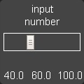

Dashboard Creation
=======================

.. figure:: images/dash.png
   :alt: UI

   UI

Dashboard Creation
-----------------------

Dashboard configuration is simple yet very powerful. Dashboards can be
created in single files or made modular for reuse of blocks of widgets.
Dashboards are configured using YAML.

We will start with a simple single-file configuration. Create a file
with a ``.dash`` extension in the ``dashboards`` directory, and pull it
up in your favorite editor.

Main Settings
~~~~~~~~~~~~~

A top-level dashboard will usually have one of several initial
directives to configure aspects of the dashboard, although they are all
optional. An example is as follows:

.. code:: yaml

    ##
    ## Main arguments, all optional
    ##
    title: Main Panel
    widget_dimensions: [120, 120]
    widget_size: [1, 1]
    widget_margins: [5, 5]
    columns: 8
    global_parameters:
        use_comma: 0
        precision: 1
        use_hass_icon: 1
        namespace: default
        devices:
          media_player:
            step: 5

These are all fairly self-explanatory:

-  ``title`` - the name that will end up in the title of the web page,
   defaults to "HADashboard".
-  ``widget_dimensions`` - the unit height and width of the individual
   widgets in pixels. Note that the absolute size is not too important
   as on tablets at least the browser will scale the page to fit. What
   is more important is the aspect ratio of the widgets as this will
   affect whether or not the dashboard completely fills the tablet's screen. The default is [120, 120] (width, height). This works well
   for a regular iPad.
-  ``widget_size`` - the number of grid blocks each widget will be by
   default if not specified
-  ``widget_margins`` - the size of blank space between widgets.
-  ``rows`` - the total number of rows in the dashboard. This will help
   with spacing, but is optional for dashboards with fewer than 15 rows
-  ``columns`` - the number of columns the dashboard will have.
-  ``scalable`` - if set to ``False`` this parameter will disable resizing and double-tap zooming on iOS devices, default is not to disable zooming.
-  ``global_parameters`` - a list of parameters that will be applied to
   every widget. If the widget does not accept that parameter, it will be
   ignored. Global parameters can be overridden at the widget definition
   if desired. This is useful for instance if you want to use commas as
   decimals for all of your widgets. This will also apply to widgets
   defined with just their entity ids so they will not require a formal
   widget definition just to change the decimal separator. The namespace
   parameter will be explained further in the namespace section of this document.
   Within the ``global`` parameters it is also possible to set parameters at the device level by including a ``device`` entry (see above for an example). Under device you can add an entry for any widget type, then under that, list global parameters that will be applied to just that widget type. For instance, in the example above, the default step size for all media players is set to 5% rather than the default 10%.

The very simplest dashboard needs a layout so it can understand where to
place the widgets. We use a ``layout`` directive to tell HADashboard how
to place them. Here is an example:

.. code:: yaml


    layout:
        - light.hall, light.living_room, input_boolean.heating
        - media_player(2x1), sensor.temperature

As you can see, here we are referring directly to native Home Assistant
entities. From this, HADashboard is able to figure out the right widget
type and grab its friendly name and add it to the dashboard. For the
``clock`` and ``weather`` widgets there is no associated entity id so
just your ``clock.clock`` or ``weather.weather``.

The layout command is intended to be visual in how you layout the
widgets. Each layout entry represents a row on the dashboard; each comma-separated widget represents a cell on that row.

Widgets can also have a size associated with them - that is the
``(2x1)`` directive appended to the name. This is simply the width of
the widget in columns and the height of the widget in rows. For
instance, ``(2x1)`` would refer to a widget 2 cells wide and 1 cell
high. If you leave of the sizing information, the widget will use the
``widget_size`` dashboard parameter if specified, or default to
``(1x1)`` if not. HADashboard will do its best to calculate the right
layout from what you give it but expect strange behavior if you add too
many widgets on a line.

For a better visual cue, you can lay the widgets out with appropriate
spacing to see what the grid will look like more intuitively:

.. code:: yaml

     layout:
        - light.hall,       light.living_room, input_boolean.heating
        - media_player(2x1),                   sensor.temperature

... and so on.

Make sure that the number of widths specified adds up to the total
number of columns, and don't forget to take into account widgets that
are more than one row high (e.g., the weather widget here).

If you want a blank space, you can use the special widget name
``spacer``. To leave a whole row empty, just leave an entry for it with
no text. For instance:

.. code:: yaml

        - light.hall, light.living_room, input_boolean.heating
        -
        - media_player(2x1), sensor.temperature

The above would leave the 2nd row empty. If you want more than one empty
line use ``empty`` as follows":

.. code:: yaml

        - light.hall, light.living_room, input_boolean.heating
        - empty: 2
        - media_player(2x1), sensor.temperature

This would leave the 2nd and 3rd rows empty.

And that is all there to it, for a simple one file dashboard.

Detailed Widget Definition
~~~~~~~~~~~~~~~~~~~~~~~~~~

The approach above is ok for simple widgets like lights, but HADashboard
has a huge range of customization options. To access these, you need to define the widget along with its associated parameters formally.

To define a widget, simply add lines elsewhere in the file. Give it a
name, a widget type and a number of optional parameters like this:

.. code:: yaml

    weather_widget:
        widget_type: weather
        units: "&deg;F"

Here we have defined a widget of type "weather" and given it an
optional parameter to tell it what units to use for temperature. Each
widget type will have different required parameters, refer to the
documentation below for a complete list for each type. All widgets
support ways to customize colors and text sizes as well as attributes
they need to understand how to link the widget to Home Assistant, such
as entity\_ids.

Lets look at a couple more examples of widget definitions:

.. code:: yaml

    andrew_presence:
        widget_type: device_tracker
        title: Andrew
        device: andrews_iphone

    clock:
        widget_type: clock

    garage:
        widget_type: switch
        title: Garage
        entity: switch.garage_door
        icon_on: fas-car
        icon_off: fas-car
        warn: 1

    light_level:
        widget_type: sensor
        title: Light Level
        units: "lux"
        precision: 0
        shorten: 1
        entity: sensor.side_multisensor_luminance_25_3

    mode:
        widget_type: sensor
        title: House Mode
        entity: input_select.house_mode

    porch_motion:
        widget_type: binary_sensor
        title: Porch
        entity: binary_sensor.porch_multisensor_sensor_27_0

    side_temperature:
        widget_type: sensor
        title: Temperature
        units: "&deg;F"
        precision: 0
        entity: sensor.side_temp_corrected

    side_humidity:
        widget_type: sensor
        title: Humidity
        units: "%"
        precision: 0
        entity: sensor.side_humidity_corrected

    weather:
        widget_type: weather
        units: "&deg;F"

    wendy_presence:
        widget_type: device_tracker
        title: Wendy
        device: wendys_iphone

Now, instead of an entity id, we refer to the name of the widgets we just
defined:

.. code:: yaml


    layout:
        - clock(2x1), weather(2x2), side_temperature(1x1), side_humidity(1x1), andrew_presence(1x1), wendy_presence(1x1)
        - mode(2x1), light_level(2x1), porch_motion(1x1), garage(1x1)

It is also possible to add a widget from a standalone file. The file
will contain a single widget definition. To create a clock widget this
way we would make a file called ``clock.yaml`` and place it in the
dashboard directory along with the dashboard. The contents would look
something like this:

.. code:: yaml

    widget_type: clock
    widget_style: "color: red"

Note that the indentation level starts at 0. To include this file, just
reference a widget called ``clock`` in the layout, and HADashboard will
automatically load the widget.

A file will override a native entity so that you can create your dashboard
just using entities, but if you want to customize a specific entity, you
can just create a file named ``<entity_name>.yaml`` and put the settings
in there. You can also override entity names by specifying a widget of
that name in the same or any other file, which will take priority over a
standalone yaml file.

And that is all there to it, for a simple one file dashboard.

Advanced Dashboard Definition
-----------------------------

When you get to the point where you have multiple dashboards, you may
want to take a more modular approach. For example,  you will find that in many
cases, you want to reuse parts of other dashboards. For instance, I have
a common header for mine consisting of a row or two of widgets I want to
see on every dashboard. I also have a footer of controls to switch
between dashboards that I want on each dashboard as well.

To facilitate this, it is possible to include additional files, inline
to build up dashboards in a more modular fashion. These additional files
end in ``.yaml`` to distinguish them from top-level dashboards. They can
contain additional widget definitions and also optionally their own
layouts.

The sub-files are included in the layout using a variation of the layout
directive:

.. code:: yaml

    layout:
        - include: top_panel

This will look for a file called ``top_panel.yaml`` in the dashboards
directory, then include it. There are a couple of different ways this
can be used.

-  If the yaml file includes its own layouts directive, the widgets
   from that file will be placed as a block, in the way described by its
   layout, making it reusable. You can change the order of the blocks
   inclusion by moving wherein the original layout directive you include them.
-  If the yaml file just includes widget definitions, it is possible to
   perform the layout in the higher level dash if you prefer so you
   still get an overall view of the dashboard. This approach has the
   benefit that you can be completely flexible in the layout whereas the
   first method defines fixed layouts for the included blocks.

I prefer the completely modular approach - here is an example of a full
top-level dashboard created in that way:

.. code:: yaml

    title: Main Panel
    widget_dimensions: [120, 120]
    widget_margins: [5, 5]
    columns: 8

    layout:
        - include: top_panel
        - include: main_middle_panel
        - include: mode_panel
        - include: bottom_panel

As you can see, it includes four modular sub-dashes. Since these pieces
all have their own layout information there is no need for additional
layout in the top-level file. Here is an example of one of the self
contained submodules (mode\_panel.yaml):

.. code:: yaml

    clock:
        widget_type: clock

    weather:
        widget_type: weather
        units: "&deg;F"

    side_temperature:
        widget_type: sensor
        title: Temperature
        units: "&deg;F"
        precision: 0
        entity: sensor.side_temp_corrected

    side_humidity:
        widget_type: sensor
        title: Humidity
        units: "%"
        precision: 0
        entity: sensor.side_humidity_corrected

    andrew_presence:
        widget_type: device_tracker
        title: Andrew
        device: andrews_iphone

    wendy_presence:
        widget_type: device_tracker
        title: Wendy
        device: dedb5e711a24415baaae5cf8e880d852

    mode:
        widget_type: sensor
        title: House Mode
        entity: input_select.house_mode

    light_level:
        widget_type: sensor
        title: Light Level
        units: "lux"
        precision: 0
        shorten: 1
        entity: sensor.side_multisensor_luminance_25_3

    porch_motion:
        widget_type: binary_sensor
        title: Porch
        entity: binary_sensor.porch_multisensor_sensor_27_0

    garage:
        widget_type: switch
        title: Garage
        entity: switch.garage_door
        icon_on: fas-car
        icon_off: fas-car
        warn: 1

    layout:
        - clock(2x1), weather(2x2), side_temperature, side_humidity, andrew_presence, wendy_presence
        - mode(2x1), light_level(2x1), porch_motion, garage

Now if we take a look at that same layout, but assume that just
the widget definitions are in the sub-blocks, we would end up with
something like this - note that we must explicitly lay out each widget
we have included in the other files:

.. code:: yaml

    title: Main Panel
    widget_dimensions: [120, 120]
    widget_margins: [5, 5]
    columns: 8

    layout:
        - include: top_panel
        - include: main_middle_panel
        - include: mode_panel
        - include: bottom_panel
        - clock(2x1), weather(2x2), side_temperature, side_humidity, andrew_presence, wendy_presence
        - mode(2x1), light_level(2x1), porch_motion, garage
        - wlamp_scene, don_scene, doff_scene, dbright_scene, upstairs_thermometer, downstairs_thermometer, basement_thermometer, thermostat_setpoint
        - obright_scene, ooff_scene, pon_scene, poff_scene, night_motion, guest_mode, cooling, heat
        - morning(2x1), day(2x1), evening(2x1), night(2x1)
        - load_main_panel, load_upstairs_panel, load_upstairs, load_downstairs, load_outside, load_doors, load_controls, reload

In this case, the actual layout including a widget must be after the
include as you might expect.

A few caveats for loaded subfiles:

-  Sub files can include other subfiles to a maximum depth of 10 -
   please avoid circular references!
-  When layout information is included in a subfile, the subfile must
   comprise 1 or more complete dashboard rows - partial rows or blocks
   are not supported.

As a final option, you can create widget definitions in the main file
and use them in the layout of the header/footer/etc. For example, if you
have a header that has a label on it that lists the room that the
dashboard is associated with, you can put the label widget definition in
the header file but all the pages get the same message. If you put the
label widget definition in the main file for the room, and reference it
from the layout in the header, each page has the right name displayed in
the header.

For example:

.. code:: yaml

    clock:
        widget_type: clock
    layout:
        - label(2x2),clock(2x2)

In this example of a header, we reference a clock and a label in the
layout. We can re-use this header, but in order to make the label change
for every page we use it on we actually define it in the dashboard file
itself, and include the header in the layout:

.. code:: yaml

    title: Den Panel
    widget_dimensions: [120, 120]
    widget_margins: [5, 5]
    columns: 8

    label:
        widget_type: label
        text: Welcome to the Den

    layout:
        - include: header

Widget Customization
--------------------

Widgets allow customization using arbitrary CSS styles for the individual
elements that make up the widget. Every widget has a
\`\ ``widget_style`` argument to apply styles to the whole widget, as
well as one or more additional style arguments that differ for each
widget. To customize a widget background, for instance:

.. code:: yaml

    clock:
      widget_type: clock
      widget_style: "background: white;"

As is usual with CSS you can feed it multiple parameters at once, e.g.:

.. code:: yaml

    clock:
      widget_type: clock
      widget_style: "background: white; font-size: 150%;"

You can use any valid CSS style here although you should probably steer
away from some of the formatting types as they may interact badly with
HADashboards formatting. Widget level styles will correctly override just
the style in the skin they are replacing.

In the case of the clock widget, it also supports ``date_style`` and
``time_style`` to modify those elements accordingly:

.. code:: yaml

    clock:
      widget_type: clock
      widget_style: "background: white"
      date_style: "color: black"
      time_style: "color: green"

Since ``date_style`` and ``time_style`` are applied to more specific
elements, they will override ``widget_style``. Also note that some
widget styles may be specified in the widget's CSS, in which case that
style will override ``widget_style`` but not the more specific styles.

State and state text
--------------------

Some widgets allow you to display not only an icon showing the state but
also text of the state itself. The following widgets allow this:

-  scene
-  binary\_sensor
-  icon
-  switch
-  device\_tracker
-  script
-  lock
-  cover
-  input\_boolean

In order to enable this, just add:

.. code:: yaml

    state_text: 1

to the widget definition. This will then make the widget show the HA
state below the icon. Since native HA state is not always very pretty, it
is also possible to map this to better values, for instance in a
different language than English.

To add a state map, just add a state\_map list to the widget definition
listing the HA states and what you actually want to be displayed. For
instance:

.. code:: yaml

    state_map:
      "on": Aan
      "off": Uit

One wrinkle here is that YAML over-enthusiastically "helps" by
interpreting things like ``on`` and ``off`` as booleans so the quotes
are needed to prevent this.

Titles
------

Each widget could have custom text for title a title2. You can use the option to force the widget to use text from entity friendly name attribute.

-  ``title_is_friendly_name`` - set title as entity friendly name if exists
-  ``title2_is_friendly_name`` - set title2 as entity friendly name if exists

Example:

.. code:: yaml

    title_is_friendly_name: 1
    title2_is_friendly_name: 1

Icons
-----

Widgets that allow the specification of icons have access to both `Font
Awesome <http://fontawesome.io/cheatsheet/>`__ and `Material
Design <https://materialdesignicons.com/>`__ Icons. To specify an icon
simply use the prefix ``mdi-`` for Material Design, and the appropriate style prefix for Font Awesome Icons.

.. code:: yaml

    icon_on: fas-bell
    icon_off: mdi-cancel

In addition, the widget can be configured to use whatever icon is
defined for it in Home Assistant by setting the parameter:

.. code:: yaml

    use_hass_icon: 1

This can also be set at the dashboard level as a global parameter.

External Commands
-----------------

The dashboard can accept commands from external systems to prompt
actions, such as navigation to different pages. These can be achieved
through a variety of means:

-  AppDaemon API Calls
-  HASS Automations/Scripts
-  Alexa Intents

The mechanism used for this is HASS custom events. AppDaemon has its own
API calls to handle these events, for further details see the
`AppDaemon API Pages <API.html>`__. The custom event name is ``ad_dashboard`` and the
dashboard will respond to various commands with associated data.

To create a suitable custom event within a HASS automation, script or
Alexa Intent, simply define the event and associated data as follows
(this is a script example):

.. code:: yaml

    alias: Navigate
    sequence:
    - event: ad_dashboard
      event_data:
        command: navigate
        timeout: 10
        target: SensorPanel
        sticky: 0

These following arguments are optional and can be used to determine
if a given device or dashboard should execute the command or not:

``deviceid``: If set, only the device(s) which has the same deviceid will
execute the command. See below how to set a deviceid.
``dashid``: If set, all devices currently on a dashboard which the title
contains the substring defined by dashid will execute the command. ex: if
dashid is set to "kichen", it will match devices which are on "kitchen lights",
"kitchen sensors", "ipad - kitchen", etc.


Setting a deviceid
~~~~~~~~~~~~~~~~~~~

A "device" is a combination of machine+browser, so a computer+firefox could
be one device, while the same computer+safari can be another. To set the
``deviceid`` of a device add the ```deviceid=your_deviceid``` parameter to
the dashboard url, for instance:

``http://192.168.1.20:5050/mypanel?deviceid=kitchentablet``

HADashboard will try to store the deviceid on the device so you don't need
to use this parameter everytime. You may use it again if you want to set
a new deviceid or if you cleaned device's cookies or the device doesnt
support it.


The current list of commands supported and associated arguments are as
follows:

navigate
~~~~~~~~

Force one or more connected dashboards to navigate to a new page

Arguments:
^^^^^^^^^

``target`` - Name of the new Dashboard to navigate to, e.g.
``SensorPanel`` - this is not a URL.
``timeout`` - length of time to stay on the new dashboard before returning to
the original. This argument is optional, and if not specified, the navigation
will be permanent.

Note that if there is a click or touch on the new panel before the
timeout expires, the timeout will be cancelled.

``return`` - dashboard to return to after the timeout has elapsed.
``sticky`` - whether or not to return to the original dashboard after it has been clicked on. The default behavior (``sticky=0``) is to remain on the new dashboard if clicked and return to the original otherwise. With ``sticky=1``, clicking the dashboard will extend the amount of time, but it will return to the original dashboard after a period of inactivity equal to ``timeout``.
``deviceid``: If set, only the device(s) which has the same deviceid will navigate.
``dashid``: If set, all devices currently on a dashboard which the title contains the substring defined by dashid will navigate.

Namespaces
----------

For a full explanation of namespaces see the ``Writing AppDaemon Apps`` Section of the guide. Namespaces may be ignored in HADashboard if only one plugin is in use.

If multiple namespaces are in use, HADashboard is able to specify either at the dashboard level or the widget level which namespace to use. This is achieved by use of the ``namespace`` parameter. This parameter may be specified for each individual widget if desired. If it is specified as one of the global parameters, it will apply to all widgets but may be overridden for individual widgets. If not specified as a global parameter, the default namespace will be used for any widgets that do not override it. For example:

.. code:: yaml

    ##
    ## Main arguments, all optional
    ##
    title: Main Panel
    widget_dimensions: [120, 120]
    widget_size: [1, 1]
    widget_margins: [5, 5]
    columns: 8
    global_parameters:
        use_comma: 0
        precision: 1
        use_hass_icon: 1
        # Not setting namespace here so the default namespace is used

    # Clock has no namespace
    clock:
        widget_type: clock

    # side_temperature doesn't specify a namespace so will use the default
    # If we specified a different namespace in the global options it would use that instead
    side_temperature:
        widget_type: sensor
        title: Temperature
        units: "&deg;F"
        precision: 0
        entity: sensor.side_temp_corrected

    # side_humidity overrides the default and uses the hass2 namespace
    # It will use hass2 regardless of any global setting
    side_humidity:
        namespace: hass2
        widget_type: sensor
        title: Humidity
        units: "%"
        precision: 0
        entity: sensor.side_humidity_corrected

One caveat to namespaces is that the RSS widget always works with the admin namespace - since the RSS feeds are supplied by AppDaemon itself, and not one of the plugins.

Widget Reference
----------------

Here is the current list of widgets and their description and supported
parameters:

alarm
~~~~~
.. figure:: images/alarm.png
   :alt: alarm

A widget to report on the state of an alarm and allow code entry

Mandatory Arguments:
^^^^^^^^^^^^^^^^^^^^

-  ``entity`` - the entity\_id of the alarm to be monitored

Optional Arguments:
^^^^^^^^^^^^^^^^^^^

-  ``title`` - the title displayed on the tile
-  ``title2`` - a second line of title text

Style Arguments:
^^^^^^^^^^^^^^^^

-  ``widget_style``
-  ``title_style``
-  ``title2_style``
-  ``state_style``
-  ``panel_state_style``
-  ``panel_code_style``
-  ``panel_background_style``
-  ``panel_button_style``

binary_sensor
~~~~~~~~~~~~~~
.. figure:: images/binary_sensor.png
   :alt: binary sensor

A widget to monitor a binary\_sensor

Mandatory arguments:
^^^^^^^^^^^^^^^^^^^

-  ``entity`` - the entity\_id of the binary\_sensor

Optional Arguments:
^^^^^^^^^^^^^^^^^^^

-  ``title`` - the title displayed on the tile
-  ``title2`` - a second line of title text
-  ``state_text``
-  ``state_map``

Style Arguments:
^^^^^^^^^^^^^^^^^^

-  ``icon_on``
-  ``icon_off``
-  ``widget_style``
-  ``icon_style_active``
-  ``icon_style_inactive``
-  ``title_style``
-  ``title2_style``
-  ``state_text_style``

camera
~~~~~~


A widget to display a refreshing camera image on the dashboard.

Mandatory arguments:
^^^^^^^^^^^^^^^^^^^

-   ``entity`` the entity\_id of the camera
-   ``base_url`` the URL to your Home Assistant install. If you wish to access
    your dashboard from an external network, then this needs to be the external
    URL to Home Assistant.

Optional Arguments:
^^^^^^^^^^^^^^^^^^^

-  ``refresh`` (seconds) -  if set, the camera image will refresh every interval. Use 0 to indicate no refresh at all. Default is 10 seconds for non-streaming cameras and 0 for streaming cameras.
-  ``stream`` - If set to `on` live data will be streamed to the dashboard instead of needing to be refreshed.


Style Arguments:
^^^^^^^^^^^^^^^^^^

-  ``widget_style``
-  ``title_style``

climate
~~~~~~~


A widget to monitor and control a climate entity

Mandatory arguments:
^^^^^^^^^^^^^^^^^^^

-  ``entity`` - the entity\_id of the climate entity

Optional Arguments:
^^^^^^^^^^^^^^^^^^^

-  ``title`` - the title displayed on the tile
-  ``title2`` - a second line of title text
-  ``step`` - the size of step in temperature when fading the slider up
   or down
-  ``units`` - the unit symbol to be displayed
- ``precision`` - the number of digits to display after the decimal point

Style Arguments:
^^^^^^^^^^^^^^^^^^

-  ``widget_style``
-  ``icon_up``
-  ``icon_down``
-  ``title_style``
-  ``title2_style``
-  ``level_style``
-  ``level2_style``
-  ``unit_style``
-  ``unit2_style``
-  ``level_up_style``
-  ``level_down_style``

clock
~~~~~


A simple 12 hour clock with the date. Not currently very customizable
but it will be improved upon.

Mandatory arguments:
^^^^^^^^^^^^^^^^^^^^

None

Optional Arguments:
^^^^^^^^^^^^^^^^^^^

-  ``time_format`` - set to "24hr" if you want military time/24 hour
   clock
-  ``show_seconds`` - set to 1 if you want to see seconds on the display
- ``date_format_country`` - Format the clock in the style of a specific country. This can take a simple value like ``us`` or more complex parameters as described `here. <https://developer.mozilla.org/en-US/docs/Web/JavaScript/Reference/Global_Objects/Intl#Locale_identification_and_negotiation>`__
- ``date_format_options`` - if using ``date_format_country`` you can also add additional options for formatting as described `here. <https://developer.mozilla.org/en-US/docs/Web/JavaScript/Reference/Global_Objects/Date/toLocaleDateString>`__. For example:

.. code:: yaml

   clock:
       widget_type: clock
       date_format_country: "ro"
       date_format_options:
         weekday: "short"
         day: "numeric"
         month: "numeric"

Style Arguments:
^^^^^^^^^^^^^^^^

-  ``widget_style``
-  ``time_style``
-  ``date_style``

cover
~~~~~
.. figure:: images/cover.png
   :alt: cover

A widget to monitor and activate a cover. At this time only the open and
close actions are supported.

Mandatory arguments:
^^^^^^^^^^^^^^^^^^^

-  ``entity`` - the entity\_id of the cover

Optional Arguments:
^^^^^^^^^^^^^^^^^^^

-  ``title`` - the title displayed on the tile
-  ``title2`` - a second line of title text
-  ``state_text``
-  ``state_map``

Style Arguments:
^^^^^^^^^^^^^^^^^^

-  ``icon_on``
-  ``icon_off``
-  ``widget_style``
-  ``icon_style_active``
-  ``icon_style_inactive``
-  ``title_style``
-  ``title2_style``

device_tracker
~~~~~~~~~~~~~~~


A Widget that reports on device tracker status. It can also be
optionally be used to toggle the status between "home" and "not\_home".

Mandatory Arguments:
^^^^^^^^^^^^^^^^^^^^

-  ``device`` - name of the device from ``known_devices.yaml``, *not*
   the entity\_id.

Optional Arguments:
^^^^^^^^^^^^^^^^^^^

-  ``title`` - the title displayed on the tile
-  ``title2`` - a second line of title text
-  ``enable`` - set to 1 to enable the widget to toggle the
   device\_tracker status
-  ``state_text``
-  ``state_map``
-  ``active_map``

Active map is used to specify states other than "home" that will be
regarded as active, meaning the icon will light up. This can be useful
if tracking a device tracker within the house using beacons for
instance.

Example:

.. code:: yaml

    wendy_presence_mapped:
      widget_type: device_tracker
      title: Wendy
      title2: Mapped
      device: wendys_iphone
      active_map:
        - home
        - house
        - back_yard
        - upstairs

In the absence of an active map, only the state ``home`` will be
regarded as active.

Style Arguments:
^^^^^^^^^^^^^^^^

-  ``icon_on``
-  ``icon_off``
-  ``widget_style``
-  ``icon_style_active``
-  ``icon_style_inactive``
-  ``title_style``
-  ``title2_style``
-  ``state_text_style``

entitypicture
~~~~~~
.. figure:: images/entity_picture.png
   :alt: entity picture

A widget to display entity picture

Mandatory arguments:
^^^^^^^^^^^^^^^^^^^

-  ``entity`` - the entity to display entity_picture attribute

Optional Arguments:
^^^^^^^^^^^^^^^^^^^

-  ``title`` - the title displayed on the tile.
-  ``base_url`` - URL to prepend before content of entity_picture.

Example:

.. code:: yaml

    entitypicture1:
        widget_type: entitypicture
        title: Weather by YR
        entity: sensor.yr_symbol

Example showing artwork of just playing an album on media player: (tested with Google Home)

.. code:: yaml

    entitypicture2:
        widget_type: entitypicture
        entity: media_player.bedroom
        base_url: https://my_domain.duckdns.org:8123
        image_style: "top: 0; bottom: 0; left: 0; right: 0;"


Style Arguments:
^^^^^^^^^^^^^^^^^^

-  ``widget_style``
-  ``title_style``
-  ``image_style``

gauge
~~~~~


A widget to report on numeric values for sensors in Home Assistant in a
gauge format.

Mandatory Arguments:
^^^^^^^^^^^^^^^^^^^^

-  ``entity`` - the entity\_id of the sensor to be monitored
-  ``max`` - maximum value to show
-  ``min`` - minimum value to show

Optional Arguments:
^^^^^^^^^^^^^^^^^^^

-  ``title`` - the title displayed on the tile
-  ``title2`` - a second line of title text
-  ``units`` - the unit symbol to be displayed, if not specified HAs
   unit will be used, specify "" for no units

Style Arguments:
^^^^^^^^^^^^^^^^

-  ``widget_style``
-  ``title_style``
-  ``title2_style``
-  ``low_color``
-  ``med_color``
-  ``high_color``
-  ``bgcolor``
-  ``color``

Note that unlike other widgets, the color settings require an actual
color, rather than a CSS style.

group
~~~~~


A widget to monitor and control a group of lights

Mandatory arguments:
^^^^^^^^^^^^^^^^^^^

-  ``entity`` - the entity\_id of the group

Optional Arguments:
^^^^^^^^^^^^^^^^^^^

-  ``title`` - the title displayed on the tile
-  ``title2`` - a second line of title text
-  ``monitored_entity`` - the actual entity to monitor

Groups currently do no report back state changes correctly when
attributes light brightness are changed. As a workaround, instead of
looking for state changes in the group, we use ``monitored_entity``
instead. This is not necessary of there are no dimmable lights in the
group; however, if there are, it should be set to the entity\_id of one
of the dimmable group members.

Style Arguments:
^^^^^^^^^^^^^^^^^^

-  ``widget_style``
-  ``icon_on``
-  ``icon_off``
-  ``icon_up``
-  ``icon_down``
-  ``title_style``
-  ``title2_style``
-  ``icon_style_active``
-  ``icon_style_inactive``
-  ``text_style``
-  ``level_style``
-  ``level_up_style``
-  ``level_down_style``

icon
~~~~


A widget to monitor the state of an entity and display a different icon and style for each listed state, and is configured in a similar manner to the following:

.. code:: yaml

   icon:
     title: icon
     widget_type: icon
     entity: binary_sensor.basement_door_sensor
     state_text: 1
     icons:
       "active":
         icon: fas-glass
         style: "color: green"
         post_service_active:
           service: homeassistant/turn_on
           entity_id: script.deactivate
       "inactive":
         icon: fas-repeat
         style: "color: blue"
         post_service_active:
           service: homeassistant/turn_on
           entity_id: script.activate
       "idle":
         icon: fas-frown
         style: "color: red"
       "default":
         icon: fas-rocket
         style: "color: cyan"

The icons list is mandatory, and each entry must contain both an icon and a style entry. It is recommended that quotes are used around the state names, as without these, YAML will translate states like ``on``  and ``off`` to ``true`` and ``false``.

Each icon can have a service call assigned by post_service_active entry - on icon click, specified service like HA script or AD sequence is called for currently active state.

The default entry icon and style will be used if the state doesn't match any in the list - meaning that it is not necessary to define all states if only 1 or 2 actually matter.

Mandatory arguments:
^^^^^^^^^^^^^^^^^^^

-  ``entity`` - the entity\_id of the binary\_sensor
-  ``icons`` - a list of icons, styles and service calls to be applied for various states

Optional Arguments:
^^^^^^^^^^^^^^^^^^^

-  ``title`` - the title displayed on the tile
-  ``title2`` - a second line of title text
-  ``state_text``
-  ``state_map``
-  ``update_delay`` - seconds to wait before processing state update

Style Arguments:
^^^^^^^^^^^^^^^^^^

-  ``widget_style``
-  ``title_style``
-  ``title2_style``
-  ``state_text_style``

iframe
~~~~~~
.. figure:: images/iframe.png
   :alt: iframe

A widget to display other content within the dashboard

Mandatory arguments:
^^^^^^^^^^^^^^^^^^^

-  ``url_list`` - a list of 1 or more URLs to cycle though. or
-  ``img_list`` - a list of 1 or more Image URLs to cycle through.

Optional Arguments:
^^^^^^^^^^^^^^^^^^^

-  ``title`` - the title displayed on the tile
-  ``refresh`` - (seconds) if set, the iframe widget will progress down
   its list every refresh period, returning to the beginning when it
   hits the end. Use this in conjunction with a single entry in the
   ``url_list`` to have a single url refresh at a set interval.

For regular HTTP sites, use the ``url_list`` argument, for images the
``img_list`` argument should work better.

Example:

.. code:: yaml

    iframe:
        widget_type: iframe
        title: Cats
        refresh: 60
        url_list:
          - https://www.pexels.com/photo/grey-and-white-short-fur-cat-104827/
          - https://www.pexels.com/photo/eyes-cat-coach-sofas-96938/
          - https://www.pexels.com/photo/silver-tabby-cat-lying-on-brown-wooden-surface-126407/
          - https://www.pexels.com/photo/kitten-cat-rush-lucky-cat-45170/
          - https://www.pexels.com/photo/grey-fur-kitten-127028/
          - https://www.pexels.com/photo/cat-whiskers-kitty-tabby-20787/
          - https://www.pexels.com/photo/cat-sleeping-62640/

Content will be shown with scroll bars, which can be undesirable. For
images this can be alleviated by using an image resizing service such as
the one offered by
`Google <https://carlo.zottmann.org/posts/2013/04/14/google-image-resizer.html>`__.

.. code:: yaml

    weather_frame:
        widget_type: iframe
        title: Radar
        refresh: 300
        frame_style: ""
        img_list:
          - https://images1-focus-opensocial.googleusercontent.com/gadgets/proxy?url=https://icons.wxug.com/data/weather-maps/radar/united-states/hartford-connecticut-region-current-radar-animation.gif&container=focus&refresh=240&resize_h=640&resize_h=640
          - https://images1-focus-opensocial.googleusercontent.com/gadgets/proxy?url=https://icons.wxug.com/data/weather-maps/radar/united-states/bakersfield-california-region-current-radar.gif&container=focus&refresh=240&resize_h=640&resize_h=640

Style Arguments:
^^^^^^^^^^^^^^^^^^

-  ``widget_style``
-  ``title_style``

input_boolean
~~~~~~~~~~~~~~


A widget to monitor and activate an input\_boolean

Mandatory arguments:
^^^^^^^^^^^^^^^^^^^

-  ``entity`` - the entity\_id of the input\_boolean

Optional Arguments:
^^^^^^^^^^^^^^^^^^^

-  ``title`` - the title displayed on the tile
-  ``title2`` - a second line of title text
-  ``state_text``
-  ``state_map``

Style Arguments:
^^^^^^^^^^^^^^^^^^

-  ``icon_on``
-  ``icon_off``
-  ``widget_style``
-  ``icon_style_active``
-  ``icon_style_inactive``
-  ``title_style``
-  ``title2_style``

input_datetime
~~~~~~~~~~~~~~


A widget to monitor and control an input\_datetime

Mandatory arguments:
^^^^^^^^^^^^^^^^^^^

-  ``entity`` - the entity\_id of the input\_datetime

Optional Arguments:
^^^^^^^^^^^^^^^^^^^

-  ``title`` - the title displayed on the tile
-  ``title2`` - a second line of title text

Style Arguments:
^^^^^^^^^^^^^^^^^^

-  ``widget_style``
-  ``title_style``
-  ``title2_style``
-  ``container_style``
-  ``date_style``
-  ``time_style``

input_number
~~~~~~~~~~~~~


A widget to monitor and control an input\_number

Mandatory arguments:
^^^^^^^^^^^^^^^^^^^

-  ``entity`` - the entity\_id of the input\_number

Optional Arguments:
^^^^^^^^^^^^^^^^^^^

-  ``title`` - the title displayed on the tile
-  ``title2`` - a second line of title text
-  ``units`` - the unit symbol to be displayed
-  ``use_comma`` - if set to one, a comma will be used as the decimal
   separator

Style Arguments:
^^^^^^^^^^^^^^^^^^

- ``title_style``
- ``title2_style``
- ``minvalue_style``
- ``maxvalue_style``
- ``value_style``
- ``slider_style``
- ``slidercontainer_style``
- ``widget_style``

input_select
~~~~~~~~~~~~


A widget to display and select values from an input_select entity in Home Assistant.

Mandatory Arguments:
^^^^^^^^^^^^^^^^^^^^

-  ``entity`` - the entity\_id of the sensor to be monitored

Optional Arguments:
^^^^^^^^^^^^^^^^^^^

-  ``title`` - the title displayed on the tile
-  ``title2`` - a second line of title text

Style Arguments:
^^^^^^^^^^^^^^^^

-  ``widget_style``
-  ``title_style``
-  ``title2_style``
-  ``select_style``
-  ``selectcontainer_style``

input_slider
~~~~~~~~~~~~~


An alternate widget to monitor and control an input number, using plus and minus buttons instead of a slider.

Mandatory arguments:
^^^^^^^^^^^^^^^^^^^

-  ``entity`` - the entity\_id of the input\_number

Optional Arguments:
^^^^^^^^^^^^^^^^^^^

-  ``title`` - the title displayed on the tile
-  ``title2`` - a second line of title text
-  ``units`` - the unit symbol to be displayed
-  ``use_comma`` - if set to one, a comma will be used as the decimal
   separator

Style Arguments:
^^^^^^^^^^^^^^^^^^

- ``title_style``
- ``title2_style``
- ``minvalue_style``
- ``maxvalue_style``
- ``value_style``
- ``slider_style``
- ``slidercontainer_style``
- ``widget_style``

input_text
~~~~~~~~~~~~~~


A widget to monitor and control an input\_text

Mandatory arguments:
^^^^^^^^^^^^^^^^^^^

-  ``entity`` - the entity\_id of the input\_text

Optional Arguments:
^^^^^^^^^^^^^^^^^^^

-  ``title`` - the title displayed on the tile
-  ``title2`` - a second line of title text

Style Arguments:
^^^^^^^^^^^^^^^^^^

-  ``widget_style``
-  ``title_style``
-  ``title2_style``
-  ``container_style``
-  ``text_style``


javascript
~~~~~~~~~~


A widget to run an arbitrary JavaScript command.

Mandatory arguments:
^^^^^^^^^^^^^^^^^^^

- ``command`` - the JavaScript command to be run.

e.g.

.. code:: yaml
   command: "alert('hello');"


Optional Arguments:
^^^^^^^^^^^^^^^^^^^

-  ``title`` - the title displayed on the tile
-  ``title2`` - a second line of title text

Style Arguments:
^^^^^^^^^^^^^^^^^^

-  ``icon_active``
-  ``icon_inactive``
-  ``widget_style``
-  ``title_style``
-  ``title2_style``
-  ``icon_active_style``
-  ``icon_inactive_style``

label
~~~~~


A widget to show a simple static text string

Mandatory arguments:
^^^^^^^^^^^^^^^^^^^

None

Optional Arguments:
^^^^^^^^^^^^^^^^^^^

-  ``title`` - the title displayed on the tile
-  ``title2`` - a second line of title text
-  ``text`` - the text displayed on the tile

Style Arguments:
^^^^^^^^^^^^^^^^^^

-  ``widget_style``
-  ``title_style``
-  ``title2_style``
-  ``value_style`` - changes the style from the text

light
~~~~~


A widget to monitor and control a dimmable light

Mandatory arguments:
^^^^^^^^^^^^^^^^^^^

-  ``entity`` - the entity\_id of the light

Optional Arguments:
^^^^^^^^^^^^^^^^^^^

-  ``icon_on``
-  ``icon_off``
-  ``title`` - the title displayed on the tile
-  ``title2`` - a second line of title text
-  ``on_attributes`` - a list of supported HA attributes to set as
   initial values for the light.

Note that ``rgb_color`` and ``xy_color`` are not specified with list
syntax as in Home Assistant scenes. See below for examples.

.. code:: yaml

    testlight2:
        widget_type: light
        entity: light.office_2
        title: office_2
        on_attributes:
            brightness: 100
            color_temp: 250

or:

.. code:: yaml

    testlight2:
        widget_type: light
        entity: light.office_2
        title: office_2
        on_attributes:
            brightness: 100
            rgb_color: 128, 34, 56

or:

.. code:: yaml

    testlight2:
        widget_type: light
        entity: light.office_2
        title: office_2
        on_attributes:
            brightness: 100
            xy_color: 0.4, 0.9

Style Arguments:
^^^^^^^^^^^^^^^^^^

-  ``widget_style``
-  ``icon_on``
-  ``icon_off``
-  ``icon_up``
-  ``icon_down``
-  ``title_style``
-  ``title2_style``
-  ``icon_style_active``
-  ``icon_style_inactive``
-  ``text_style``
-  ``level_style``
-  ``level_up_style``
-  ``level_down_style``

lock
~~~~


A widget to monitor and activate a lock

Note that unlike HASS, Dashboard regards an unlocked lock as active. By
contrast, the HASS UI shows a locked lock as "on". Since the purpose of
the dashboard is to alert at a glance on anything that is unusual, I
chose to make the unlocked state "active" which means in the default
skin it is shown as red, whereas a locked icon is shown as gray. You can
easily change this behavior by setting active and inactive styles if you
prefer.

Mandatory arguments:
^^^^^^^^^^^^^^^^^^^

-  ``entity`` - the entity\_id of the lock

Optional Arguments:
^^^^^^^^^^^^^^^^^^^

-  ``title`` - the title displayed on the tile
-  ``title2`` - a second line of title text
-  ``state_text``
-  ``state_map``

Style Arguments:
^^^^^^^^^^^^^^^^^^

-  ``icon_on``
-  ``icon_off``
-  ``widget_style``
-  ``icon_style_active``
-  ``icon_style_inactive``
-  ``title_style``
-  ``title2_style``

london_underground
~~~~~~~~~~~~~~~~~~
.. figure:: images/london_underground.png
   :alt: london underground

A widget to report on the status of a London Underground line and
provide the reason for delays if there are any. Requires the London
Underground sensor to be configured in Home Assistant. This widget is
designed to be a 2x2 tile.

It is recommended to update the background style to reflect the color
of the underground line. An example would be as follows:

.. code:: yaml

  widget_style: "background-color: #0098D4"

The colors of the various lines are:
- Bakerloo: #B36305
- Central: #E32017
- Circle: #FFD300
- District: #00782A
- DLR: #00A4A7
- Hammersmith & City: #F3A9BB
- Jubilee: #A0A5A9
- London Overground: #EE7C0E
- Metropolitan: #9B0056
- Northern: #000000
- Piccadilly: #003688
- Victoria: #0098D4
- Waterloo & City: #95CDBA

For smaller dashboards the Description text can be too long to fit in
the widget properly. In that case, hide the text as follows:

.. code:: yaml

  state_text_style: "display: none"

Mandatory arguments:
^^^^^^^^^^^^^^^^^^^^

-  ``entity`` - the entity to be monitored

Optional Arguments:
^^^^^^^^^^^^^^^^^^^

-  ``title`` - the title displayed on the tile

Style Arguments:
^^^^^^^^^^^^^^^^^^^

-  ``state_text_style``
-  ``text_style``
-  ``title_style``
-  ``widget_style``

media_player
~~~~~~~~~~~~~


A widget to monitor and control a media player

Mandatory arguments:
^^^^^^^^^^^^^^^^^^^

-  ``entity`` - the entity\_id of the media player

Optional Arguments:
^^^^^^^^^^^^^^^^^^^

-  ``title`` - the title displayed on the tile
-  ``title2`` - a second line of title text
-  ``truncate_name`` - if specified, the name of the media will be
   truncated to this length.
-  ``step`` - the step (in percent) that the volume buttons will use.
   (default, 10%)

Style Arguments:
^^^^^^^^^^^^^^^^^^

-  ``widget_style``
-  ``icon_on``
-  ``icon_off``
-  ``icon_up``
-  ``icon_down``
-  ``title_style``
-  ``title2_style``
-  ``icon_style_active``
-  ``icon_style_inactive``
-  ``text_style``
-  ``level_style``
-  ``level_up_style``
-  ``level_down_style``

mode
~~~~


A widget to track the state of an ``input_select`` by showing active
when it is set to a specific value. Also allows scripts to be run when
activated.

Mandatory arguments:
^^^^^^^^^^^^^^^^^^^

-  ``entity`` - the entity\_id of the ``input_select``
-  ``mode`` - value of the input select to show as active
-  ``script`` - script to run when pressed
-  ``state_text``
-  ``state_map``

Optional Arguments:
^^^^^^^^^^^^^^^^^^^

-  ``title`` - the title displayed on the tile
-  ``title2`` - a second line of title text

Style Arguments:
^^^^^^^^^^^^^^^^

-  ``icon_on``
-  ``icon_off``
-  ``widget_style``
-  ``icon_style_active``
-  ``icon_style_inactive``
-  ``title_style``
-  ``title2_style``


navigate
~~~~~~~~


A widget to navigate to a new URL, intended to be used for switching
between dashboards.

Mandatory arguments:
^^^^^^^^^^^^^^^^^^^

None, but either ``url`` or ``dashboard`` must be specified.

Optional Arguments:
^^^^^^^^^^^^^^^^^^^

-  ``url`` - a url to navigate to. Use a full URL including the `http://`
   or `https://` part.
-  ``dashboard`` - a dashboard to navigate to e.g. ``MainPanel``
-  ``title`` - the title displayed on the tile
-  ``args`` - a list of arguments.
-  ``skin`` - Skin to use with the new screen (for HADash URLs only)
-  ``forward_parameters`` - a list of URL parameters that should be forwarded
   from the current dashboard URL to the next dashboard. For example, if the
   current dashboard was called with "&deviceid=1234&otherparameter=foo",
   adding "deviceid" to ``forward_parameters`` will preserve "deviceid" and
   discard "otherparameter=foo". You may add "all" to the ``forward_parameters``
   to forward all parameters, except "timeout", "return", "sticky" as this can cause
   problems. If ``forward_parameters`` is not used, then only skin is preserved.

For an arbitrary URL, Args can be anything. When specifying a dashboard
parameter, args have the following meaning:

-  ``timeout`` - length of time to stay on the new dashboard
-  ``return`` - dashboard to return to after the timeout has elapsed.
-  ``sticky`` - whether or not to return to the original dashboard after it has been clicked on. The default behavior (``sticky=0``) is to remain on the new dashboard if clicked and return to the original otherwise. With ``sticky=1```, clicking the dashboard will extend the amount of time, but it will return to the original dashboard after a period of inactivity equal to ``timeout``.

Both ``timeout`` and ``return`` must be specified.

If adding arguments, use the args variable. Do not append them to the URL
or you may break skinning. Add arguments like this:

.. code:: yaml

    some_widget:
        widget_type: navigate
        title: Amazon
        url: http://amazon.com
        args:
          arg1: fred
          arg2: jim

or:

.. code:: yaml

    some_widget:
        widget_type: navigate
        title: Sensors
        dashboard: Sensors
        args:
          timeout: 10
          return: Main

Style Arguments:
^^^^^^^^^^^^^^^^^^

-  ``icon_active``
-  ``icon_inactive``
-  ``widget_style``
-  ``title_style``
-  ``title2_style``
-  ``icon_active_style``
-  ``icon_inactive_style``

person
~~~~~~


A Widget that reports on the status of a person. It can also be
optionally be used to toggle the status between "home" and "not\_home".

Mandatory Arguments:
^^^^^^^^^^^^^^^^^^^^

-  ``entity`` - entity of the person, e.g. ``person.andrew``.

Optional Arguments:
^^^^^^^^^^^^^^^^^^^

-  ``title`` - the title displayed on the tile
-  ``title2`` - a second line of title text
-  ``enable`` - set to 1 to enable the widget to toggle the
   person status
-  ``state_text``
-  ``state_map``
-  ``active_map``

Active map is used to specify states other than "home" that will be
regarded as active, meaning the icon will light up. This can be useful
if tracking a device tracker within the house using beacons for
instance.

Example:

.. code:: yaml

    wendy_presence_mapped:
      widget_type: person
      title: Wendy
      title2: Mapped
      entity: person.wendy
      active_map:
        - home
        - house
        - back_yard
        - upstairs

In the absence of an active map, only the state ``home`` will be
regarded as active.

Style Arguments:
^^^^^^^^^^^^^^^^

-  ``icon_on``
-  ``icon_off``
-  ``widget_style``
-  ``icon_style_active``
-  ``icon_style_inactive``
-  ``title_style``
-  ``title2_style``
-  ``state_text_style``

radial
~~~~~~


A widget to display a numeric value as a gauge

Mandatory Arguments:
^^^^^^^^^^^^^^^^^^^^

-  ``entity`` - the entity\_id of the alarm to be monitored
- ``settings`` - a list if values describing the gauge with the following entries:

- title - title of the guage
- minValue - minimum value to display
- maxValue - maximum value to display
- majorTicks - Where to mark major values, a list
- highlights - color ranges, a list

See the example below:

.. code:: yaml

      your_radial:
        widget_type: radial
        entity: sensor.your_sensor
        settings:
          title: any title
          minValue: 0
          maxValue: 100
          majorTicks: [0,20,40,60,80,100]
          highlights: [{'from': 0, 'to': 18, 'color': 'rgba(0,0, 255, .3)'},{'from': 25, 'to': 100, 'color': 'rgba(255, 0, 0, .3)'}]


Optional Arguments:
^^^^^^^^^^^^^^^^^^^

None

Style Arguments:
^^^^^^^^^^^^^^^^

None

reload
~~~~~~


A widget to reload the current dashboard.

Mandatory arguments:
^^^^^^^^^^^^^^^^^^^

None.

Optional Arguments:
^^^^^^^^^^^^^^^^^^^

-  ``title`` - the title displayed on the tile
-  ``title2`` - a second line of title text

Style Arguments:
^^^^^^^^^^^^^^^^^^

-  ``icon_active``
-  ``icon_inactive``
-  ``widget_style``
-  ``title_style``
-  ``title2_style``
-  ``icon_active_style``
-  ``icon_inactive_style``

rss
~~~


A widget to display an RSS feed.

Note that the actual feeds are configured in appdaemon.yaml as follows:

.. code:: yaml

    hadashboard:

      rss_feeds:
        - feed: <feed_url>
          target: <target_name>
        - feed: <feed url>
          target: <target_name>

          ...

      rss_update: <feed_refresh_interval>

-  ``feed_url`` - fully qualified path to rss feed, e.g.,
   ``http://rss.cnn.com/rss/cnn_topstories.rss``
-  ``target name`` - the entity of the target RSS widget in the
   dashboard definition file. This must be an arbitrary name prepended by ``rss.`` - e.g., ``rss.cnn_news``
-  ``feed_refresh_interval`` - how often AppDaemon will refresh the RSS
   feeds

There is no limit to the number of feeds you configure, and you will
need to configure one RSS widget to display each feed.

Mandatory Arguments:
^^^^^^^^^^^^^^^^^^^^

-  ``entity`` - the name of the configured feed - this must match the
   ``target_name`` full target name configured in the AppDaemon configuration e.g. `rss.cnn_news`
-  ``interval`` - the period between display of different items within
   the feed

Optional Arguments:
^^^^^^^^^^^^^^^^^^^

-  ``title`` - the title displayed on the tile
-  ``title2`` - a second line of title text
-  ``recent`` - the number of most recent stories that will be shown. If not specified, all stories in the feed will be shown.
-  ``show_description`` - if set to ``1`` the widget will show a short description of the story as well as the title. Default is ``0``


Style Arguments:
^^^^^^^^^^^^^^^^

-  ``widget_style``
-  ``title_style``
-  ``title2_style``
-  ``text_style``

scene
~~~~~


A widget to activate a scene

Mandatory arguments:
^^^^^^^^^^^^^^^^^^^

-  ``entity`` - the entity\_id of the scene

Optional Arguments:
^^^^^^^^^^^^^^^^^^^

-  ``title`` - the title displayed on the tile
-  ``title2`` - a second line of title text
-  ``state_text``
-  ``state_map``

Style Arguments:
^^^^^^^^^^^^^^^^

-  ``icon_on``
-  ``icon_off``
-  ``widget_style``
-  ``icon_style_active``
-  ``icon_style_inactive``
-  ``title_style``
-  ``title2_style``

script
~~~~~~


A widget to run a script

Mandatory arguments:
^^^^^^^^^^^^^^^^^^^

-  ``entity`` - the entity\_id of the script

Optional Arguments:
^^^^^^^^^^^^^^^^^^^

-  ``title`` - the title displayed on the tile
-  ``title2`` - a second line of title text
-  ``state_text``
-  ``state_map``
-  ``enabled`` - if set to 0 the switch cant be pressed but only shows status
-  ``momentary`` - after the set amount of milliseconds the old state returns (momentary button)

Style Arguments:
^^^^^^^^^^^^^^^^

-  ``icon_on``
-  ``icon_off``
-  ``widget_style``
-  ``icon_style_active``
-  ``icon_style_inactive``
-  ``title_style``
-  ``title2_style``

scene
~~~~~


A widget to run a sequence

Mandatory arguments:
^^^^^^^^^^^^^^^^^^^

-  ``entity`` - the entity\_id of the sequence e.g. ``sequence.office_on``

Optional Arguments:
^^^^^^^^^^^^^^^^^^^

-  ``title`` - the title displayed on the tile
-  ``title2`` - a second line of title text
-  ``state_text``
-  ``state_map``

Style Arguments:
^^^^^^^^^^^^^^^^

-  ``icon_on``
-  ``icon_off``
-  ``widget_style``
-  ``icon_style_active``
-  ``icon_style_inactive``
-  ``title_style``
-  ``title2_style``

sensor
~~~~~~


A widget to report on values for any sensor in Home Assistant

The widget will detect whether or not it is showing a numeric value, and
if so, it will use the numeric style. If it is showing text, it will use
the text style, which among other things makes the text size smaller.
To display an attribute of a sensor rather than the state itself add
the attribute to the end of the sensor name. For example, to display the
description of the sensor.dark_sky_summary sensor you would use the
following entity definition: "sensor.dark_sky_summary.Description".

Note that you can define a sub_entity to be an attribute of the entity
using the entity_to_sub_entity_attribute argument, or an entity as an
attribute of the sub_entity using the sub_entity_to_entity_attribute.

Mandatory Arguments:
^^^^^^^^^^^^^^^^^^^^

-  ``entity`` - the entity\_id of the sensor to be monitored

Or

-  ``sub_entity`` - the entity\_id of the sensor to be monitored

Optional Arguments:
^^^^^^^^^^^^^^^^^^^

-  ``title`` - the title displayed on the tile
-  ``title2`` - a second line of title text
-  ``units`` - the unit symbol to be displayed, if not specified HAs
   unit will be used, specify "" for no units
-  ``precision`` - the number of decimal places
-  ``shorten`` - if set to one, the widget will abbreviate the readout
   for high numbers, e.g. ``1.1K`` instead of ``1100``
-  ``use_comma`` - if set to one\`, a comma will be used as the decimal
   separator
-  ``state_map``
-  ``sub_entity`` - second entity to be displayed in the state text area
-  ``sub_entity_map`` - state map for the sub\_entity
-  ``entity_to_sub_entity_attribute`` - the attribute of the entity to use
   as the sub_entity
-  ``sub_entity_to_entity_attribute`` - the attribute of the sub_entity to
   use as the entity

Style Arguments:
^^^^^^^^^^^^^^^^

-  ``widget_style``
-  ``title_style``
-  ``title2_style``
-  ``value_style``
-  ``text_style``
-  ``unit_style``
-  ``container_style``
-  ``state_text_style`` (used for styling of ``sub_entity``)

switch
~~~~~~


A widget to monitor and activate a switch

Mandatory arguments:
^^^^^^^^^^^^^^^^^^^

-  ``entity`` - the entity\_id of the switch

Optional Arguments:
^^^^^^^^^^^^^^^^^^^

-  ``title`` - the title displayed on the tile
-  ``title2`` - a second line of title text
-  ``state_text``
-  ``state_map``
-  ``enabled`` - if set to 0 the switch cant be pressed but only shows status
-  ``momentary`` - after the set amount of milliseconds the old state returns (momentary button)

Style Arguments:
^^^^^^^^^^^^^^^^^^

-  ``icon_on``
-  ``icon_off``
-  ``widget_style``
-  ``icon_style_active``
-  ``icon_style_inactive``
-  ``title_style``
-  ``title2_style``

temperature
~~~~~~~~~~~


A widget to report display a temperature using a thermometer style view

Mandatory Arguments:
^^^^^^^^^^^^^^^^^^^^

-  ``entity`` - the entity\_id of the alarm to be monitored
- ``settings`` - a list if values describing the thermometer with the following entries:

- minValue - minimum value to display
- maxValue - maximum value to display
- width - width of the widget, set this to the same width as your cell size or less
- height - height of the widget, set this to the same height as your cell size or less
- majorTicks - Where to mark major values, a list
- highlights - color ranges, a list

See the example below:

.. code:: yaml

   your_temperature:
     widget_type: temperature
     entity: sensor.your_sensor
     settings:
       minValue: 15
       maxValue: 30
       width: 120
       height: 120
       majorTicks: [15,20,25,30]
       highlights: [{'from': 15, 'to': 18, 'color': 'rgba(0,0, 255, .3)'},{'from': 24, 'to': 30, 'color': 'rgba(255, 0, 0, .3)'}]

Optional Arguments:
^^^^^^^^^^^^^^^^^^^

None

Style Arguments:
^^^^^^^^^^^^^^^^

None

weather
~~~~~~~


Up to date weather reports. By default, it's configured to work with dark sky
sensor. To use all the features, you need to add these sensors to
monitored_conditions:

-  temperature
-  apparent\_temperature
-  temperature_min
-  temperature_max
-  humidity
-  precip\_probability
-  precip\_intensity
-  precip\_type
-  wind\_speed
-  wind\_bearing
-  pressure
-  icon

To have the forecast displayed set ``show_forecast`` to 1. For it to work you
additionally, need to add the forecast option in dark_sky Home Assistant
configuration.

.. code:: yaml

    forecast:
      - 1

Mandatory arguments:
^^^^^^^^^^^^^^^^^^^^

None

Optional Arguments:
^^^^^^^^^^^^^^^^^^^

- ``title``
- ``show_forecast`` - show the forecast
- ``prefer_icons`` - use icons instead of text
- ``forecast_title`` - title of the forecast if enabled
- ``sensors`` - list of sensors used by the widget

You can change the entities used by the widget by overwriting their values
in the ``sensors`` key in configuration.

Example with default values:

.. code:: yaml

    sample_weather:
      widget_type: weather
      title: Today
      show_forecast: 1
      prefer_icons: 1
      forecast_title: Tomorrow
      sensors:
        icon: sensor.dark_sky_icon
        temperature: sensor.dark_sky_temperature
        apparent_temperature: sensor.dark_sky_apparent_temperature
        humidity: sensor.dark_sky_humidity
        precip_probability: sensor.dark_sky_precip_probability
        precip_intensity: sensor.dark_sky_precip_intensity
        precip_type: sensor.dark_sky_precip
        pressure: sensor.dark_sky_pressure
        wind_speed: sensor.dark_sky_wind_speed
        wind_bearing: sensor.dark_sky_wind_bearing
        forecast_icon: sensor.dark_sky_icon_1
        forecast_temperature_min: sensor.dark_sky_daily_low_temperature_1
        forecast_temperature_max: sensor.dark_sky_daily_high_temperature_1
        forecast_precip_probability: sensor.dark_sky_precip_probability_1
        forecast_precip_type: sensor.dark_sky_precip_1

Style Arguments:
^^^^^^^^^^^^^^^^^^^

-  ``widget_style``
-  ``main_style``
-  ``unit_style``
-  ``sub_style``
-  ``sub_unit_style``
-  ``title_style``

weather_summary
~~~~~~~~~~~~~~~


An icon and summary reflecting the weather forecast. Requires dark sky to be
configured in Home Assistant and expects to be used with one of the
following sensors:

-  sensor.dark_sky_daily_summary
-  sensor.dark_sky_hourly_summary
-  sensor.dark_sky_summary

Mandatory arguments:
^^^^^^^^^^^^^^^^^^^^

-  ``entity`` - the entity to be monitored

Optional Arguments:
^^^^^^^^^^^^^^^^^^^

-  ``title`` - the title displayed on the tile

Style Arguments:
^^^^^^^^^^^^^^^^^^^

-  ``state_text_style``
-  ``text_style``
-  ``title_style``
-  ``widget_style``


Skins
-----

HADashboard fully supports skinning and ships with a number of skins. To
access a specific skin, append the parameter ``skin=<skin name>`` to the
dashboard URL. Skin names are sticky if you use the Navigate widget to
switch between dashboards and will stay in force until another skin or
no skin is specified.

HADashboard currently has the following skins available:

-  default - the classic HADashboard skin, very simple
-  obsidian, contributed by ``@rpitera``
-  zen, contributed by ``@rpitera``
-  simplyred, contributed by ``@rpitera``
-  glassic, contributed by ``@rpitera``

Skin development
----------------

HADashboard fully supports customization through skinning. It ships with
a number of skins courtesy of @rpitera, and we encourage users to create
new skins and contribute them back to the project.

To create a custom skin you will need to know a little bit of CSS. Start
off by creating a directory called ``custom_css`` in the configuration
directory, at the same level as your dashboards directory. Next, create
a subdirectory in ``custom_css`` named for your skin.

The skin itself consists of 2 separate files:

-  ``dashboard.css`` - This is the base dashboard CSS that sets the widget
   styles, background, look and feel, etc.
-  ``variables.yaml`` - This is a list of variables that describe how
   different elements of the widgets will look. Using the correct
   variables you can skin pretty much every element of every widget
   type.

Dashboard.css is a regular CSS file, and knowledge of CSS is required to
make changes to it.

Variables.yaml is really a set of override styles, so you can use
fragments of CSS here, basically, anything that you could normally put in
an HTML ``style`` tag. Variables .yaml also supports variable expansion
to make structuring the file easier. Anything that starts with a ``$``
is treated as a variable that refers back to one of the other yaml
fields in the file.

Here is an example of a piece of a variables.yaml file:

.. code:: yaml

    ##
    ## Styles
    ##

    white: "#fff"
    red: "#ff0055"
    green: "#aaff00"
    blue: "#00aaff"
    purple: "#aa00ff"
    yellow: "#ffff00"
    orange: "#ffaa00"

    gray_dark: "#444"
    gray_medium: "#666"
    gray_light: "#888"

    ##Page and widget defaults
    background_style: ""
    text_style: ""

    ##These are used for icons and indicators
    style_inactive: "color: $gray_light"
    style_active: "color: gold"
    style_active_warn: "color: gold"
    style_info: "color: gold; font-weight: 500; font-size: 250%"
    style_title: "color: gold; font-weight: 900"
    style_title2: "color: $white"

Here we are setting up some general variables that we can reuse for
styling the actual widgets.

Below, we are setting styles for a specific widget, the light widget.
All entries are required but can be left blank by using double-quotes.

.. code:: yaml

    light_icon_on: fas-circle
    light_icon_off: fas-circle-thin
    light_icon_up: fas-plus
    light_icon_down: fas-minus
    light_title_style: $style_title
    light_title2_style: $style_title2
    light_icon_style_active: $style_active
    light_icon_style_inactive: $style_inactive
    light_state_text_style: $white
    light_level_style: "color: $gray_light"
    light_level_up_style: "color: $gray_light"
    light_level_down_style: "color: $gray_light"
    light_widget_style: ""

Images can be included - create a sub directory in your skin directory,
call it ``img`` or whatever you like, then refer to it in the css as:

``/custom_css/<skin name>/<image directory>/<image filename>``

One final feature is the ability to include additional files in the
header and body of the page if required. This can be useful to allow
additional CSS from 3rd parties or include JavaScript.

Custom head includes - should be a YAML List inside ``variables.yaml``,
e.g.:

.. code:: yaml

    head_includes:
      - some include
      - some other include

Text will be included verbatim in the head section of the doc, use for
styles, javascript or 3rd party CSS, etc. etc. It is your responsibility
to ensure the HTML is correct

Similarly, for body includes:

.. code:: yaml

    body_includes:
      - some include
      - some other include

To learn more about complete styles, take a look at the supplied styles
to see how they are put together. Start off with the ``dashboard.css``
and ``variables.yaml`` from an existing file and edit to suit your
needs.

Javascript
----------

There are a lot of ways to use javascript in Dashboard.
You can create custom widgets that will need javascript, use the javascript
widget to trigger a javascript function or you can add javascript directly
to the head includes or body includes.

Custom widgets require their own special .js files, but to trigger a function
from the javascript widget or from the body includes you can create a
``custom_javascript`` directory in the configuration directory.
All files that are placed in that directory will automaticly included in
Dashboard.
All functions you place in a .js file inside that directory will be
available everywhere in dashboard.
Remember that you do this on your own responsibility. javscript code in
those files can break Dashboards, and create vulnerabilities.

Example Dashboards
------------------

Some example dashboards are available in the AppDaemon repository:

`Dashboards <https://github.com/home-assistant/appdaemon/tree/dev/conf/example_dashboards>`__

A Note on Font Awesome Upgrade
------------------------------

As of AppDaemon 3.0.2, Font Awesome icons have been upgraded from version 4 to version 5. FA Introduced a lot of breaking changes with this upgrade. While all of HADashboard's included skins have been updated to reflect this, any custom skins may need changes, as will any custom icons used within dashboard config files. FA have provided a table of changed icons `here <https://fontawesome.com/how-to-use/on-the-web/setup/upgrading-from-version-4>`__.

To ease the transition further, a legacy mode has been included in HADashboard. This is not enabled by default, but can be turned on by specifying the following in the hadashboard section of ``appdaemon.cfg``:

.. code:: yaml

    fa4compatibility: 1

This is not intended as a permanent fix and may be removed at some point, but for now, this will enable existing skins and icons to work correctly, giving you an opportunity to work through your configurations and fix things.

While working through the upgrade, it is strongly advised that you clear your browser cache and force recompile all of your dashboards to flush out references to old icons. This can be done by manually removing the ``compiled`` subdirectory in ``conf_dir``, specifying ``recompile=1`` in the arguments to the dashboard, or setting the hadashboard option ``dash_compile_on_start`` to ``1``.
