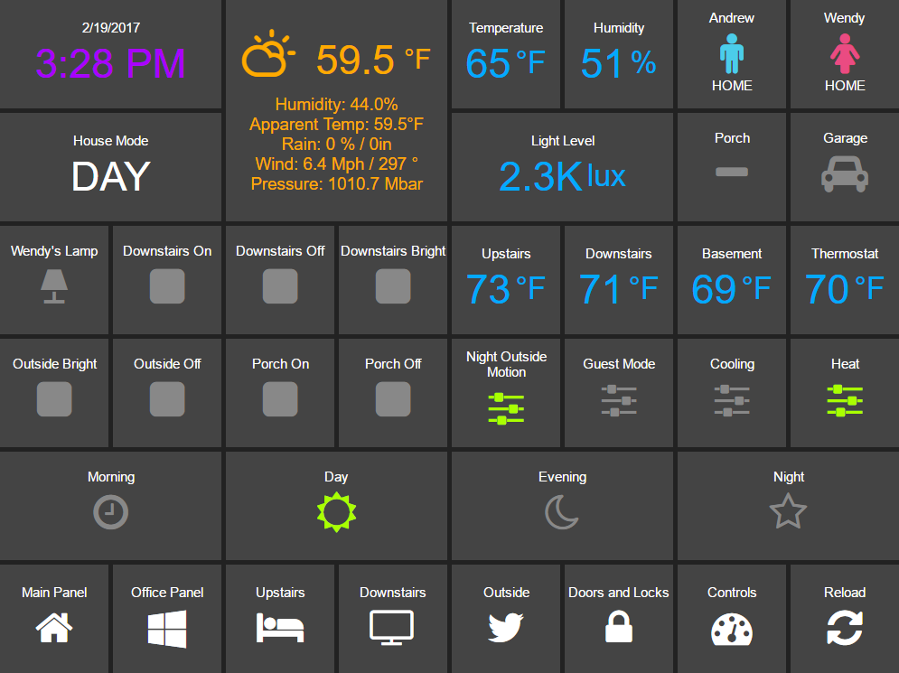

Dashboard Install and Configuration
===================================

HADashboard is a dashboard for `Home
Assistant <https://home-assistant.io/>`__ that is intended to be wall
mounted, and is optimized for distance viewing.

Installation and Configuration
------------------------------

HADashboard is dependent upon AppDaemon. As a first step please refer to
the `AppDaemon Installation Documentation <INSTALL.html>`__.

When you have AppDaemon installed and running, configuration of the
Dashboard is pretty simple. You just need to add a ``hadashboard`` directive to the
``appdaemon.yaml`` file. For instance:

.. code:: yaml

    appdaemon:
        ...
    hadashboard:

By default, dashboards are searched for under the config directory in a
sub directory called ``dashboards``. Optionally, you can place your
dashboards in a directory other than under the config directory using
the ``dashboard_dir`` directive. For example:

.. code:: yaml

    hadashboard:
        dashboard_dir: /etc/appdaemon/dashboards

Once initial configuration is complete, you will need to create the ``dashboards`` directive either under
the conf directory, or wherever you specify with ``dash_dir``. Once that
is done, for testing purposes, create a file in the dashboards directory
called ``Hello.dash`` and paste in the following:

.. code:: yaml

    ##
    ## Main arguments, all optional
    ##
    title: Hello Panel
    widget_dimensions: [120, 120]
    widget_margins: [5, 5]
    columns: 8

    label:
        widget_type: label
        text: Hello World

    layout:
        - label(2x2)

When you have added the lines to the config and created the dashboards
directory and test dashboard, restart AppDaemon and you will be ready
to go. If you navigate to the top level, e.g.,
``http://192.168.1.20:5050`` in the case above, you will see a welcome
page with a list of configured dashboards. If you haven't yet configured
any the list will be empty.

When you have created a dashboard you can navigate to it by going to
``http://192.168.1.20:5050/<Dashboard Name>``

If you are using AppDaemon just for the dashboard and not the Apps, you
can disable the app engine with the following directive:

.. code:: yaml

    appdaemon:
      disable_apps: 1

This will free up some CPU and memory.

HADashboard pre-compiles all of the user created Dashboard for
efficiency. It will detect when changes have been made to widgets,
styles or dashboards and automatically recompile. This is usually
desirable as compilation can take several seconds on slower hardware for
a fully loaded dashboard, however to force a recompilation every time,
use the following directive:

.. code:: yaml

    hadashboard:
        force_compile: 1

This will force dashboard recompilation whenever the dashboard is
loaded. You can also force a recompilation by adding the parameter
``recompile=1`` to the dashboard URL.

By default, information and errors around access to the Dashboard will
go to the same place as AppDaemon's log. To split the page access out to
a different file, use the ``access_log`` directives in the ``logs`` section. For example:

.. code:: yaml

    logs:
      access_log:
        filename: /export/pegasus/hass/appdaemon_test/logs/access.log

To force dashboard recompilation of all dashboards after a restart, use:

.. code:: yaml

    hadashboard:
      compile_on_start: 1

This should not be necessary but may on occasion be required after an
upgrade to pickup changes. This is now the default if not otherwise specified.

Dashboard URL Parameters
------------------------

The dashboard URL supports a couple of extra parameters:

-  ``skin`` - name of the skin you want to use, default is ``default``
-  ``recompile`` - set to anything to force a recompilation of the
   dashboard
- ``deviceid``- set a deviceid. See how to use it in 
  `External Commands <DASHBOARD_CREATION.html#external-commands>`__.

For example, the following url will load a dashboard called main with the
obsidian skin:

::

    http://<ip address>:<port>/Main?skin=obsidian
