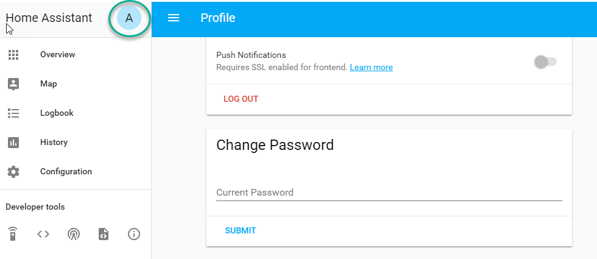
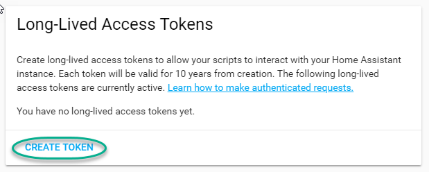
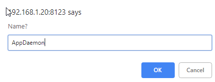
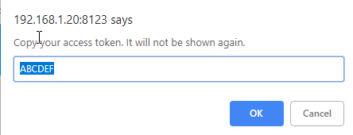

Hass Plugin/API
===============

About
-----

Hass Plugin
~~~~~~~~~~~

The `Hass` plugin connects to Home Assistant using the
`websocket API <https://developers.home-assistant.io/docs/api/websocket/>`_ and maintains this connection while
AppDaemon is running. In addition, it maintains an HTTP session because some functionality is only available via the
`REST API <https://developers.home-assistant.io/docs/api/rest>`_. If the connection is lost, the plugin will gracefully
attempt to reconnect every 5s until it succeeds, any apps that are using the `Hass` API will be stopped and restarted
when the connection is re-established.

Hass API
~~~~~~~~

The :py:class:`Hass <appdaemon.plugins.hass.hassapi.Hass>` API is an interface layer that makes it easy for users to
interact with the `Hass` plugin. In addition to all the methods of the ``ADAPI``, it provides many methods that are
specific to Home Assistant. Most of these methods simply wrap calling services with some logic that make them more
convenient to use.

Plugin Configuration
--------------------

The `Hass` plugin must be configured in the ``appdaemon.yaml`` file under the ``plugins`` section in order for it to
connect to Home Assistant. This example shows where it fits into the overall configuration file.

.. code:: yaml

    # conf/appdaemon.yaml
    appdaemon:
      ... # other AppDaemon config here
      plugins:
        HASS:         # This is the name of the plugin, it can be anything
          type: hass  # required
          ha_url: ... # required
          token: ...  # required
          ... # other Hass plugin config options here

Configuration Options
~~~~~~~~~~~~~~~~~~~~~

This is the full list of configuration options available for the `Hass` plugin.

.. list-table:: HASS Plugin Configuration Options
   :header-rows: 1
   :widths: 20 6 80

   * - **Key**
     - **Note**
     - **Description**
   * - ``type``
     - required
     - This must be declared and it must be the exact value ``hass``.
   * - ``ha_url``
     - required
     - URL to a Home Assistant instance, must include correct port and scheme (``http://`` or ``https://``)
   * - ``token``
     - required
     - Long-lived token for for authentication with Home Assistant. See the
       `section on authentication <#authentication>`_ for more information on how to set it up.
   * - ``ha_key``
     - deprecated
     - Use ``token`` instead
   * - ``retry_secs``
     - optional
     - Time to sleep between connection attempts. Defaults to 5 seconds.
   * - ``cert_verify``
     - optional
     - Flag for adding an SSL context around the ``aiohttp.ClientSession``. Set to ``False`` to disable (e.g., with internal IPs)
   * - ``cert_path``
     - optional
     - Path to the SSL certificate file. This is only used if ``cert_verify`` is set to ``True``.
   * - ``api_port``
     - optional
     - Port the AppDaemon RESTful API will listen on. If not specified, API is disabled
   * - ``ws_timeout``
     - optional
     - Timeout for waiting for Home Assistant response from the websocket API. This is the time between when a websocket
       message is first sent and when Home Assistant responds with some kind of acknowledgement/result. Config values
       are parsed with :py:func:`parse_timedelta <appdaemon.utils.parse_timedelta>`. Defaults to 10 seconds.
   * - ``suppress_log_messages``
     - optional
     - If ``true``, suppress log messages related to :py:meth:`call_service <appdaemon.plugins.hass.hassapi.Hass.call_service>`.
       Defaults to ``false``.
   * - ``app_init_delay``
     - optional
     - Delay in seconds before initializing apps and listening for events
   * - ``appdaemon_startup_conditions``
     - optional
     - See the `startup control section <#startup-control>`_ for more information.
   * - ``plugin_startup_conditions``
     - optional
     - See the `startup control section <#startup-control>`_ for more information.

Authentication
~~~~~~~~~~~~~~

The `Hass` plugin needs a long-lived access token to authenticate with Home Assistant over the websocket. This is
provided to AppDaemon by the ``token`` directive in the plugin configuration.

To create a long-lived access token, use the following steps:

1. Login as the user that you want to create the token for and open the user profile. The profile is found by clicking
the icon next to the ``Home Assistant`` label to the left of the web ui when the burger menu is clicked:

2. At the bottom of the user profile is the Long-Lived Access Tokens section. Click on "Create Token"

This will pop up a dialog that asks you for the name of the token - this can be anything, it's just to remind you what
the token was created for - ``AppDaemon`` is as good a name as any. When you are done click ``OK``

3. A new dialog will popup with the token itself showing:

Copy this string and add it as the argument of the ``token`` directive in your HASS Plugin section:

.. code:: yaml

    token: ABCDEF

A real token will be a lot longer than this and will consist of a string of random letters and numbers. For example:

``eyJ0eXAiOiJKV1QiLCJhbGciOiJIUzI1NiJ9.eyJpc3MiOiIwZmRkYmE0YTM0MTY0...``

4. A reference to your new token will be shown in the Long-Lived tokens section, and you can revoke access via this
token at any time by pressing the delete icon. The token will last for 10 years.

.. figure:: images/list.png
   :alt: List

Startup Control
~~~~~~~~~~~~~~~

The `Hass` plugin has the ability to pause startup until various criteria have been met. This can be useful for
preventing apps that depend on certain entities or services from starting before they are available. AppDaemon will not
mark the plugin as ready until all of these conditions have been met, which prevents any apps that depend on the plugin
from being started. Each condition only has to be met once for it to be considered satisfied.

When the plugin first starts with AppDaemon itself, it will check the conditions in the ``appdaemon_startup_conditions``
key before starting any apps. If the connection to Home Assistant is broken and re-established, it will check the
conditions in the ``plugin_startup_conditions`` key before starting any apps.

.. admonition:: Starting Event
  :class: note

    If/when the `Hass` plugin reconnects to Home Assistant, it will wait for the ``homeassistant_started`` event before
    starting any of the apps that use the `Hass` API. Home Assistant will accept connections very early as it's
    starting, even before some fundamental components have been loaded, which causes most apps to somehow fail without
    waiting for this event. This is the same event that the Home Assistant web UI waits for to indicate readiness.

.. code:: yaml

    # conf/appdaemon.yaml
    appdaemon:
      ... # other AppDaemon config here
      plugins:
        HASS:
          type: hass  # required
          ha_url: ... # required
          token: ...  # required
          ... # other Hass plugin config options here
          appdaemon_startup_conditions:
            delay: ...
            state: ...
            event: ...
          plugin_startup_conditions:
            delay: ...
            state: ...
            event: ...

delay
^^^^^

Delay startup for a number of seconds, for example:

.. code:: yaml

    delay: 10 # delays for 10s

state
^^^^^

Wait until a specific state exists or has a specific value or set of values. The values can be specified as an inline dictionary as follows:

- wait until an entity exists - ``state: {entity: <entity id>}``
- wait until an entity exists and has a specific value for its state: ``state: {entity: <entity id>, value: {state: "on"}}``
- wait until an entity exists and has a specific value for an attribute: ``state: {entity: <entity id>, value: {attributes: {attribute: value}}}``

Example to wait for an input boolean:

.. code:: yaml

    state:
      entity: input_boolean.appdaemon_enable # example entity name
      value:
        state: "on" # on needs to be in quotes

Example to wait for a light to be on full brightness:

.. code:: yaml

    state:
      entity: light.office_1 # example entity
      value:
        state: "on" # on needs to be in quotes
        attributes:
          brightness: 255 # full brightness

event
^^^^^

Wait for an event or an event with specific data

- wait for an event of a given type: ``{event_type: <event name>}``
- wait for an event with specific data: ``{event_type: <event name>, data: {service_data: {entity_id: <some entity>}, service: <some service>}}``

Example to wait for ZWave to complete initialization upon a HASS restart:

.. code:: yaml

    event:
      event_type: zwave.network_ready

Example to wait for an input button before starting AppDaemon

.. code:: yaml

    event:
      event_type: call_service
      data:
        domain: input_button
        service: press
        service_data:
          entity_id: input_button.start_appdaemon # example entity

API Usage
---------

Create apps using the `Hass` API by inheriting from the :py:class:`Hass <appdaemon.plugins.hass.hassapi.Hass>` class:

.. code:: python

    from appdaemon.plugins.hass import Hass

    class MyApp(Hass):
        def initialize(self):
            ... # Your initialization code here

Read the `AppDaemon API Reference <AD_API_REFERENCE.html>`__ to learn other inherited helper functions that
can be used by Hass applications.

Services
~~~~~~~~

Services are now called `actions` in Home Assistant, but are sometimes also referred to as `service actions`. Any of
them can be called by using the :py:meth:`call_service <appdaemon.plugins.hass.hassapi.Hass.call_service>` method with
their domain and service name.

The specific services available will vary depending on which integrations are installed in Home Assistant, but some
common ones would be ``light/toggle``, ``switch/turn_off``, etc. These services would control physical devices, but
services can do many other things as well.

.. admonition:: Service Name Delimiter
  :class: note

    AppDaemon uses the ``/`` delimiter to separate the domain and service name, instead of the ``.`` used by Home
    Assistant, so ``light.turn_on`` in Home Assistant becomes ``light/turn_on`` in AppDaemon.

Returning values
^^^^^^^^^^^^^^^^

As of AppDaemon v4.5.0, service calls can return values. When services are registered with AppDaemon, Home Assistant
indicates whether they return values and whether doing so is optional. AppDaemon uses that information to automatically
insert ``"return_response": true`` into the message it sends to Home Assistant if necessary.

.. admonition:: Home Assistant Responses
  :class: note

    Home Assistant always responds with some kind of acknowledgement, even for services that don't otherwise return a
    value. AppDaemon includes whatever it gets from Home Assistant in the result dict.

.. list-table:: Result Dict
   :header-rows: 1
   :widths: 20 80

   * - **Key**
     - **Value**
   * - ``id``
     - Sequential ID of the websocket request. This matches the one that AppDaemon used with the initial request.
   * - ``type``
     - This will always be ``result``, as returned from Home Assistant.
   * - ``success``
     - Boolean representing whether the service call was successful or not.
   * - ``result``
     - Dict with the result of the service call if it was successful.
   * - ``error``
     - Dict with error information if the service call was not successful.
   * - ``ad_status``
     - Status from AppDaemon for the request.
   * - ``ad_duration``
     - Floating point number representing the round trip time of the request in seconds.

.. list-table:: AppDaemon Statuses
   :header-rows: 1
   :widths: 20 80

   * - **Status**
     - **Value**
   * - ``OK``
     - Indicates that the process of calling the service didn't fail on the AppDaemon side. It could still have failed
       on the Home Assistant side.
   * - ``TIMEOUT``
     - The service call timed out while waiting for a response from Home Assistant. This can happen if the
       ``ws_timeout`` is set too low or if Home Assistant is overloaded.
   * - ``TERMINATING``
     - Indicates that the task for the service call was cancelled while it was waiting for a response from Home
       Assistant.

.. admonition:: Revealed Errors
  :class: warning

    With service calls now returning values, it's possible for operations that were silently failing before to now
    produce warnings or errors. In most cases, this is beneficial/desired, but these can also be suppressed. For
    example, Z-Wave devices are known to take a long time to respond, which can cause timeouts. However, most services
    return nearly instantly.

Timeouts
^^^^^^^^

These timeouts determine how long AppDaemon will wait for a response from Home Assistant before giving up and returning
with a ``TIMEOUT`` for ``ad_status`` in the result dict.

.. list-table::
   :header-rows: 1
   :widths: 20 80

   * - **Timeout**
     - **Explanation**
   * - ``hass_timeout``
     - Provided with the service call and only affects that specific call.
   * - ``ws_timeout``
     - Provided in ``appdaemon.yaml`` and used as the default for all service calls. Can be overridden by
       ``hass_timeout``.
   * - ``internal_function_timeout``
     - Provided in ``appdaemon.yaml`` and controls how long the app will internally wait for a response from the main
       AppDaemon thread.

Services and states
^^^^^^^^^^^^^^^^^^^

Setting the state of an entity only changes how it appears in Home Assistant, which is perfect for sensors, but not
devices like lights. To physically turn on a light, you should call the ``light/turn_on`` service. Merely setting the
state will not do that.

Service Registration
^^^^^^^^^^^^^^^^^^^^

The `Hass` plugin registers the initial set of services immediately after it authenticates with Home Assistant.
Afterwards, AppDaemon will register services whenever Home Assistant emits ``service_registered`` events. This makes all
of the services/actions in Home Assistant available to AppDaemon apps. Users can still register their own services from
apps using the ``register_service`` method.

Advanced Service Calls
^^^^^^^^^^^^^^^^^^^^^^

The `Hass` API ultimately wraps the
`calling a service action <https://developers.home-assistant.io/docs/api/websocket/#calling-a-service-action>`_ feature
of the websocket API, so `anything` that can be done through that API, can be done with AppDaemon. Successfully calling
the service action merely depends on formatting the arguments to
:py:meth:`call_service <appdaemon.plugins.hass.hassapi.Hass.call_service>` correctly.

Here's one example

.. code-block:: python

    from appdaemon.plugins.hass import Hass

    class MyApp(Hass):
        def initialize(self) -> None:
            self.call_service(
                "notify/alexa_media",
                service_data={
                    "target": "media_player.tom_office",
                    "data": {"type": "announce"}
                },
                # other kwargs also will be included in service_data
                message="This is a test message"
            )

.. code-block:: JSON

    // JSON sent to Home Assistant over websocket API
    {
        "type": "call_service",
        "domain": "notify",
        "service": "alexa_media",
        "service_data": {
            "target": "media_player.tom_office",
            "data": {
                "type": "announce"
            },
            "message": "This is a test message"
        },
        "id": 7 // This ID is generated by AppDaemon and is used to match the response whenever it arrives
    }

The kwarg ``target`` can't be used directly because it would conflict with ``target`` being used in other services, like
this:

.. code-block:: python

    from appdaemon.plugins.hass import Hass

    class SimpleApp(Hass):
        def initialize(self) -> None:
            self.call_service("light/turn_on", target="light.kitchen", brightness=255)

.. code-block:: JSON

    // JSON sent to Home Assistant over websocket API
    {
        "type": "call_service",
        "domain": "light",
        "service": "turn_on",
        "service_data": {
            "brightness": 255
        },
        "target": "light.kitchen",
        "id": 7 // This ID is generated by AppDaemon and is used to match the response whenever it arrives
    }

Debugging
^^^^^^^^^

Some services require a complex set of data, which can require some tinkering to format correctly. There are a few
techniques that are useful for determining how that data should be formatted, starting with looking at the log text.
Unless suppressed, AppDaemon will log warnings for any failed service calls. These warnings will have whatever message
Home Assistant returned with the error, which is often helpful.

Beyond that, it's possible to inspect the services more closely by using the
:py:meth:`get_service_info <appdaemon.plugins.hass.hassapi.Hass.get_service_info>` method. This returns a nested dict
of information about the service, which comes from a call to
`get_services <https://developers.home-assistant.io/docs/api/websocket/#fetching-service-actions>`_ that AppDaemon does
internally. This contains a little more detail than is visible in the Home Assistant developer tools.

.. code-block:: python
  :emphasize-lines: 10

    from appdaemon.plugins.hass import Hass

    class MyApp(Hass):
        def initialize(self):
            service = "climate/set_temperature"
            self.log_service_details(service)

        def log_service_details(self, service: str) -> None:
            if service_info := self.get_service_info(service):
                self.log(f"{service}: {service_info['name']}")
                for field, info in service_info['fields'].items():
                    self.log(f"  {field}: {info['description']}")
                    match info:
                        case {'selector': {'number': {'min': min_value, 'max': max_value}}}:
                            self.log(f"    {min_value} to {max_value}")
                        case {'selector': {'select': {'options': options}}}:
                            self.log(f"    {', '.join(options)}")
                        case _:
                            pass

.. code:: text

    INFO my_app: climate/set_temperature: Set target temperature
    INFO my_app:   temperature: The temperature setpoint.
    INFO my_app:     0 to 250
    INFO my_app:   target_temp_high: The max temperature setpoint.
    INFO my_app:     0 to 250
    INFO my_app:   target_temp_low: The min temperature setpoint.
    INFO my_app:     0 to 250
    INFO my_app:   hvac_mode: HVAC operation mode.
    INFO my_app:     off, auto, cool, dry, fan_only, heat_cool, heat

Turning up the logging level to ``DEBUG`` to inspect the raw JSON being sent over the websocket.

.. code-block:: YAML

    # conf/appdaemon.yaml
    appdaemon:
      ...             # rest of AppDaemon config here
      module_debug:
        HASS: DEBUG   # This must match the name of the plugin
      plugins:
        HASS:         # This is the name of the plugin, which can be changed
          type: hass  # This must be exactly "hass"
          ...         # rest of Hass plugin config here

Error Handling
^^^^^^^^^^^^^^

Python got a :py:ref:`match/case structure in v3.10 <match>`, which has some very convenient patterns for handling the
results returned by service calls. See :py:ref:`this tutorial <tut-match>` for more information about the different ways
to use it. For example, this service call will fail because it has ``bogus_arg=42``, which isn't allowed by the
``light/turn_on`` service in Home Assistant.

.. code-block:: python

    from appdaemon.plugins.hass import Hass
    from appdaemon.utils import format_timedelta

    class MyApp(Hass):
        def initialize(self):
            service = "climate/set_temperature"
            res = self.call_service(service, entity_id="climate.living_room", bogus_arg=42)
            match res:
                case {'success': True}:
                    self.log("Service call was successful")
                case {'success': False, 'ad_status': 'OK', 'ad_duration': duration}:
                    time_str = format_timedelta(duration)
                    self.log(f"Service call failed on the Home Assistant side, and took {time_str}")
                case _:
                    self.log(f"Unexpected response format from service call: {res}")

.. code:: text

    WARNING HASS: Error with websocket result: invalid_format: must contain at least one of temperature, target_temp_high, target_temp_low.
    INFO my_app: Service call failed on the Home Assistant side, and took 8.583ms

By default, AppDaemon will log warnings for any service call that fails. If you prefer to do error checking yourself on
a per-call basis you can set the ``suppress_log_messages`` argument to ``True`` when using
:py:meth:`call_service <appdaemon.plugins.hass.hassapi.Hass.call_service>`, or you can suppress log messages globally by
setting ``suppress_log_messages`` to true in the plugin configuration.

.. code-block:: python
  :emphasize-lines: 11

    from appdaemon.plugins.hass import Hass

    class MyApp(Hass):
        def initialize(self):
            service = "climate/set_temperature"
            res = self.call_service(
                service,
                entity_id="light.kitchen",
                bogus_arg=42,
                suppress_log_messages=True,
            )
            match res:
                case {'success': True}:
                    self.log("Service call was successful")
                case {'success': False, 'ad_status': 'OK', 'error': error}:
                    self.handle_error(service, **error)
                case _:
                    self.log(f"Unexpected response format from service call: {res}")

        def handle_error(self, service: str, code: str, message: str) -> None:
            self.log(f"Service call failed: {message}", level="ERROR")
            match code:
                case "invalid_format":
                    if service_info := self.get_service_info(service):
                        valid_fields = service_info.get("fields", {})
                        field_names = "\n".join(f"  - {f}" for f in valid_fields)
                        self.log(
                            f"The service call had an invalid format. "
                            f"Valid fields are:\n{field_names}",
                            level="ERROR",
                        )
                case _:
                    self.log(f"Unhandled error: {code}: {message}", level="ERROR")

.. code:: text

    ERROR my_app: Service call failed: must contain at least one of temperature, target_temp_high, target_temp_low.
    ERROR my_app: The service call had an invalid format. Valid fields are:
      - temperature
      - target_temp_high
      - target_temp_low
      - hvac_mode

Rendering Templates
~~~~~~~~~~~~~~~~~~~

Home Assistant has a powerful `templating <https://www.home-assistant.io/docs/configuration/templating/>`_ engine that
can be used to render templates in your apps. The `Hass` API provides access to this with the
:py:meth:`render_template <appdaemon.plugins.hass.hassapi.Hass.render_template>` method.

API Reference
-------------

.. autoclass:: appdaemon.plugins.hass.hassapi::Hass
    :members:
    :member-order: bysource
