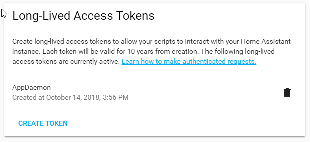

Hass Plugin/API
===============

About the Plugin
----------------

The `Hass` plugin connects to Home Assistant using the
`websocket API <https://developers.home-assistant.io/docs/api/websocket/>`_ and maintains this connection while
AppDaemon is running. In addition, it maintains an HTTP session because some functionality is only available via the
`REST API <https://developers.home-assistant.io/docs/api/rest>`_. If the connection is lost, the plugin will gracefully
attempt to reconnect every 5s until it succeeds, any apps that are using the `Hass` API will be stopped and restarted
when the connection is re-established.

.. admonition:: Starting Event
  :class: note

    If/when the `Hass` plugin reconnects to Home Assistant, it will wait for the ``homeassistant_started`` event before
    starting any of the apps that use the `Hass` API. Home Assistant will accept connections very early as it's
    starting, even before some fundamental components have been loaded, which causes most apps to somehow fail without
    waiting for this event. This is the same event that the Home Assistant web UI waits for to indicate readiness.

Plugin Configuration
--------------------

See the `configuration section <CONFIGURE.html#hass>`__ of the documentation for more information.

.. code:: yaml

    # conf/appdaemon.yaml
    appdaemon:
      ... # other AppDaemon config here
      plugins:
        HASS:
          type: hass  # required
          ha_url: ... # required
          token: ...  # required
          ... # other Hass plugin config options here

Configuration Options
~~~~~~~~~~~~~~~~~~~~~

This is the full list of configuration options available for the `Hass` plugin.

.. list-table:: HASS Plugin Configuration Options
   :header-rows: 1
   :widths: 20 6 80

   * - **Key**
     - **Note**
     - **Description**
   * - ``type``
     - required
     - This must be declared and it must be the exact value ``hass``.
   * - ``ha_url``
     - required
     - URL to a Home Assistant instance, must include correct port and scheme (``http://`` or ``https://``)
   * - ``token``
     - required
     - Long-lived token for for authentication with Home Assistant.
   * - ``ha_key``
     - deprecated
     - Use ``token`` instead
   * - ``retry_secs``
     - optional
     - Time to sleep between connection attempts. Defaults to 5 seconds.
   * - ``cert_verify``
     - optional
     - Flag for adding an SSL context around the ``aiohttp.ClientSession``. Set to ``False`` to disable (e.g., with internal IPs)
   * - ``cert_path``
     - optional
     - Path to the SSL certificate file. This is only used if ``cert_verify`` is set to ``True``.
   * - ``api_port``
     - optional
     - Port the AppDaemon RESTful API will listen on. If not specified, API is disabled
   * - ``ws_timeout``
     - optional
     - Timeout for waiting for Home Assistant response from the websocket API. This is the time between when a websocket
       message is first sent and when Home Assistant responds with some kind of acknowledgement/result. Config values
       are parsed with :py:func:`parse_timedelta <appdaemon.utils.parse_timedelta>`. Defaults to 10 seconds.
   * - ``suppress_log_messages``
     - optional
     - If ``true``, suppress log messages related to :py:meth:`call_service <appdaemon.plugins.hass.hassapi.Hass.call_service>`.
       Defaults to ``false``.
   * - ``app_init_delay``
     - optional
     - Delay in seconds before initializing apps and listening for events
   * - ``appdaemon_startup_conditions``
     - optional
     - See the `startup control section <#startup-control>`_ for more information.
   * - ``plugin_startup_conditions``
     - optional
     - See the `startup control section <#startup-control>`_ for more information.

Authentication
~~~~~~~~~~~~~~

The `Hass` plugin needs a long-lived access token to authenticate with Home Assistant over the websocket. This is
provided to AppDaemon by the ``token`` directive in the plugin configuration.

To create a long-lived access token, use the following steps:

1. Login as the user that you want to create the token for and open the user profile. The profile is found by clicking
the icon next to the ``Home Assistant`` label to the left of the web ui when the burger menu is clicked:

.. figure:: images/Profile.png
   :alt: Profile

2. At the bottom of the user profile is the Long-Lived Access Tokens section. Click on "Create Token"

.. figure:: images/create_token.png
   :alt: Create Token

This will pop up a dialog that asks you for the name of the token - this can be anything, it's just to remind you what
the token was created for - ``AppDaemon`` is as good a name as any. When you are done click ``OK``

.. figure:: images/popup.png
   :alt: Popup

3. A new dialog will popup with the token itself showing:

Copy this string and add it as the argument of the ``token`` directive in your HASS Plugin section:

.. code:: yaml

    token: ABCDEF

A real token will be a lot longer than this and will consist of a string of random letters and numbers. For example:

``eyJ0eXAiOiJKV1QiLCJhbGciOiJIUzI1NiJ9.eyJpc3MiOiIwZmRkYmE0YTM0MTY0...``

4. A reference to your new token will be shown in the Long-Lived tokens section, and you can revoke access via this
token at any time by pressing the delete icon. The token will last for 10 years.

Startup Control
~~~~~~~~~~~~~~~

The `Hass` plugin has the ability to pause startup until various criteria have been met. This can be useful for
preventing apps that depend on certain entities or services from starting before they are available. AppDaemon will not
mark the plugin as ready until all of these conditions have been met, which prevents any apps that depend on the plugin
from being started. Each condition only has to be met once for it to be considered satisfied.

When the plugin first starts with AppDaemon itself, it will check the conditions in the ``appdaemon_startup_conditions``
key before starting any apps. If the connection to Home Assistant is broken and re-established, it will check the
conditions in the ``plugin_startup_conditions`` key before starting any apps.

.. code:: yaml

    # conf/appdaemon.yaml
    appdaemon:
      ... # other AppDaemon config here
      plugins:
        HASS:
          type: hass  # required
          ha_url: ... # required
          token: ...  # required
          ... # other Hass plugin config options here
          appdaemon_startup_conditions:
            delay: ...
            state: ...
            event: ...
          plugin_startup_conditions:
            delay: ...
            state: ...
            event: ...

delay
^^^^^

Delay startup for a number of seconds, for example:

.. code:: yaml

    delay: 10 # delays for 10s

state
^^^^^

Wait until a specific state exists or has a specific value or set of values. The values can be specified as an inline dictionary as follows:

- wait until an entity exists - ``state: {entity: <entity id>}``
- wait until an entity exists and has a specific value for its state: ``state: {entity: <entity id>, value: {state: "on"}}``
- wait until an entity exists and has a specific value for an attribute: ``state: {entity: <entity id>, value: {attributes: {attribute: value}}}``

Example to wait for an input boolean:

.. code:: yaml

    state:
      entity: input_boolean.appdaemon_enable # example entity name
      value:
        state: "on" # on needs to be in quotes

Example to wait for a light to be on full brightness:

.. code:: yaml

    state:
      entity: light.office_1 # example entity
      value:
        state: "on" # on needs to be in quotes
        attributes:
          brightness: 255 # full brightness

event
^^^^^

Wait for an event or an event with specific data

- wait for an event of a given type: ``{event_type: <event name>}``
- wait for an event with specific data: ``{event_type: <event name>, data: {service_data: {entity_id: <some entity>}, service: <some service>}}``

Example to wait for ZWave to complete initialization upon a HASS restart:

.. code:: yaml

    event:
      event_type: zwave.network_ready

Example to wait for an input button before starting AppDaemon

.. code:: yaml

    event:
      event_type: call_service
      data:
        domain: input_button
        service: press
        service_data:
          entity_id: input_button.start_appdaemon # example entity

API Usage
---------

Create apps using the `Hass` API by inheriting from the :py:class:`Hass <appdaemon.plugins.hass.hassapi.Hass>` class:

.. code:: python

    from appdaemon.plugins.hass import Hass

    class MyApp(Hass):
        def initialize(self):
            ... # Your initialization code here

Read the `AppDaemon API Reference <AD_API_REFERENCE.html>`__ to learn other inherited helper functions that
can be used by Hass applications.

Services
~~~~~~~~

Services are now called `actions` in Home Assistant, but are sometimes also referred to as `service actions`. Any of
them can be called by using the :py:meth:`call_service() <appdaemon.plugins.hass.hassapi.Hass.call_service>` method with
their domain and service name. However AppDaemon uses the ``/`` delimter to separate the domain and service name,
instead of the ``.`` used by Home Assistant, so ``light.turn_on`` in Home Assistant becomes ``light/turn_on`` in
AppDaemon.

The specific services available will vary depending on which integrations are installed in Home Assistant, but some
common ones would be ``light/toggle``, ``switch/turn_off``, etc. These services would control physical devices, but
services can do many other things as well.

Returning values
^^^^^^^^^^^^^^^^

As of AppDaemon v4.5.0, service calls can return values. When services are registered with AppDaemon, Home Assistant
indicates whether they return values and whether doing so is optional. AppDaemon uses that information to automatically
insert ``"return_response": true`` into the message it sends to Home Assistant if necessary.

.. list-table:: Result Dict
   :header-rows: 1
   :widths: 20 80

   * - **Key**
     - **Value**
   * - ``id``
     - Sequential ID of the websocket request. This matches the one that AppDaemon used with the initial request.
   * - ``type``
     - This will always be ``result``, as returned from Home Assistant.
   * - ``success``
     - Boolean representing whether the service call was successful or not.
   * - ``result``
     - Dict with the result of the service call if it was successful.
   * - ``error``
     - Dict with error information if the service call was not successful.
   * - ``ad_status``
     - Status from AppDaemon for the request.
   * - ``ad_duration``
     - Floating point number representing the round trip time of the request in seconds.

.. admonition:: Home Assistant Responses
  :class: note

    Home Assistant always responds with some kind of acknowledgement, even for services that don't otherwise return a
    value. AppDaemon includes whatever it gets from Home Assistant in the result dict.

Services and states
^^^^^^^^^^^^^^^^^^^

Setting the state of an entity only changes how it appears in Home Assistant. That's perfect for some thing like sensors,
but not for something like a light. To physically turn on a light, you should call the ``light/turn_on`` service. Merely
setting the state will not do that.

Advanced Service Calls
^^^^^^^^^^^^^^^^^^^^^^

The `Hass` API ultimately wraps the
`calling a service action <https://developers.home-assistant.io/docs/api/websocket/#calling-a-service-action>`_ feature
of the websocket API, so `anything` that can be done through that API, can be done with AppDaemon. Successfully calling
the service action merely depends on formatting the arguments to
:py:meth:`call_service() <appdaemon.plugins.hass.hassapi.Hass.call_service>` correctly.

Rendering Templates
~~~~~~~~~~~~~~~~~~~

Home Assistant has a powerful templating engine that can be used to render templates in your apps.

API Reference
-------------

.. autoclass:: appdaemon.plugins.hass.hassapi::Hass
    :members:
    :member-order: bysource
